# GitHub Actions & Workflows — What, Why, and How
> This document explains GitHub Actions from the ground up, using **this repository's own workflow** — [`.github/workflows/maestro-test-suit.yml`](../.github/workflows/maestro-test-suit.yml) — as the running example. That workflow builds the WorkIndia Android app and runs Maestro end-to-end (E2E) tests on an Android emulator.
---
## Table of Contents
1. [What is GitHub Actions?](#1-what-is-github-actions)
2. [Why do we use it?](#2-why-do-we-use-it)
3. [The building blocks (concepts & vocabulary)](#3-the-building-blocks-concepts--vocabulary)
4. [How a workflow runs — the big picture](#4-how-a-workflow-runs--the-big-picture)
5. [Our workflow, dissected line by line](#5-our-workflow-dissected-line-by-line)
6. [The full journey of our Maestro workflow (diagram)](#6-the-full-journey-of-our-maestro-workflow)
7. [Expressions, contexts, and variables](#7-expressions-contexts-and-variables)
8. [Caching — why our builds are fast](#8-caching--why-our-builds-are-fast)
9. [Artifacts — getting results out](#9-artifacts--getting-results-out)
10. [Triggers you could add next](#10-triggers-you-could-add-next)
11. [GitHub Actions vs. our Jenkins pipelines](#11-github-actions-vs-our-jenkins-pipelines)
12. [Cheat sheet](#12-cheat-sheet)
---
## 1. What is GitHub Actions?
**GitHub Actions is GitHub's built-in CI/CD (Continuous Integration / Continuous Delivery) platform.** It lets you run automated tasks — building code, running tests, releasing apps — directly from your repository, triggered by events that happen on GitHub (a push, a pull request, a button click, a schedule, …).
Everything is described in **YAML files** that live inside the repository under:
```text
.github/
└── workflows/
    └── maestro-test-suit.yml   ← our only workflow (for now)
```
Because the automation is *versioned alongside the code*, a change to the build process is reviewed in a pull request just like any other code change.
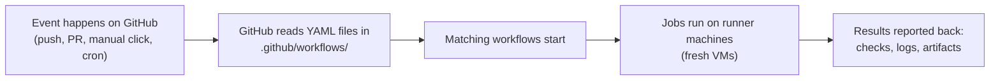
---
## 2. Why do we use it?
| Problem without CI | How GitHub Actions solves it |
|---|---|
| "It works on my machine" — builds behave differently per developer | Every run starts on a **fresh, identical virtual machine**, so results are reproducible |
| Manual testing is slow and easy to forget | Tests run **automatically** on every trigger; nobody has to remember |
| Broken code gets merged unnoticed | A failing workflow shows a red ❌ on the commit/PR, blocking merges if you want |
| Release steps are tribal knowledge in someone's head | The whole process is **codified in YAML**, reviewable and versioned |
| Long feedback loops | Runs happen in parallel on cloud machines the moment code changes |
For this repository specifically: building an Android APK, booting an emulator, and clicking through the entire app with Maestro takes a long time and a beefy machine. GitHub Actions gives us an **8-vCPU cloud machine on demand** (`blacksmith-8vcpu-ubuntu-2204`) that does all of it unattended and uploads the test results at the end — even when the tests fail.
---
## 3. The building blocks (concepts & vocabulary)
GitHub Actions has a small hierarchy of concepts. From the outside in:
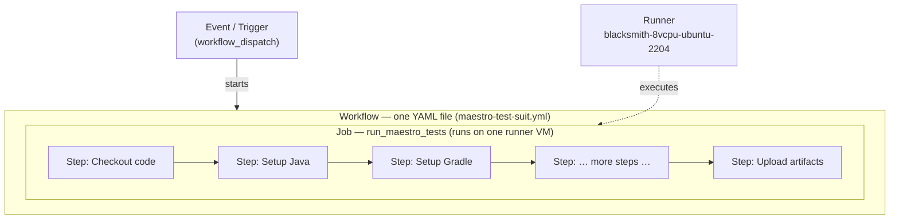
| Term | What it is | In our workflow |
|---|---|---|
| **Event / trigger** | The thing that starts a workflow (`on:`) | `workflow_dispatch` — a manual "Run workflow" button in the Actions tab |
| **Workflow** | One YAML file = one automated process | `Run Maestro Tests` |
| **Job** | A group of steps that runs on **one machine**. Jobs can run in parallel or depend on each other | `run_maestro_tests` (we have a single job) |
| **Runner** | The machine (VM) a job executes on. GitHub-hosted, self-hosted, or third-party | `blacksmith-8vcpu-ubuntu-2204` — a third-party (Blacksmith) high-performance runner |
| **Step** | A single task inside a job. Runs sequentially, shares the same filesystem | "Checkout code", "Build Debug APK", … (10 steps total) |
| **Action** | A **reusable, packaged step** published by GitHub or the community, referenced with `uses:` | `actions/checkout@v4`, `actions/setup-java@v4`, `reactivecircus/android-emulator-runner@v2` |
| **`run:` step** | A step that executes raw shell commands instead of a packaged action | The `sed` commands, `./gradlew assemblePreproductionDebug`, … |
| **Artifact** | Files a job saves so you can download them after the run | `maestro-results` (test reports, kept 7 days) |
| **Cache** | Files persisted **between** runs to speed things up | Gradle build cache + the `~/.maestro` install |
> **Key distinction — `uses:` vs `run:`**
> `uses:` pulls in a pre-built action someone already wrote (like importing a library).
> `run:` executes shell commands you write yourself (like writing your own code).
> A good workflow mixes both: reuse where possible, script where necessary.
---
## 4. How a workflow runs — the big picture
The lifecycle of any GitHub Actions run:
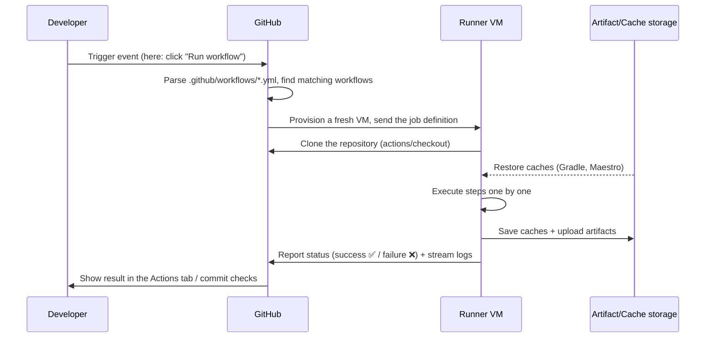
Important properties to internalize:
- **Every run starts from a clean slate.** The runner VM has nothing from previous runs except what you explicitly restore from *cache*.
- **Steps in a job run sequentially and share a filesystem** — that's why our "Build Debug APK" step can install the APK produced two steps earlier.
- **If any step fails, later steps are skipped by default** — unless a step opts out with `if: always()` (ours does, for uploading test results).
- **Logs stream live** — you can watch the emulator boot and tests run in real time from the Actions tab.
---
## 5. Our workflow, dissected line by line
Below is [`maestro-test-suit.yml`](../.github/workflows/maestro-test-suit.yml) explained section by section.
### 5.1 Name and trigger
```yaml
name: Run Maestro Tests
on:
  workflow_dispatch:
```
- `name:` is what shows in the Actions tab sidebar.
- `on: workflow_dispatch:` means this workflow **only runs when a human presses the "Run workflow" button** (GitHub → *Actions* tab → *Run Maestro Tests* → *Run workflow*). Nothing happens automatically on push or PR. This makes sense here because a full E2E suite is expensive (~up to 90 minutes) — you run it deliberately, not on every commit.
### 5.2 Workflow-level environment variables
```yaml
env:
  GRADLE_OPTS: "-Dorg.gradle.daemon=false -Dorg.gradle.parallel=true -Dorg.gradle.caching=true"
```
`env:` at the top level injects environment variables into **every step of every job**. Here we tune Gradle: no long-lived daemon (pointless on a throwaway VM), parallel module builds, and the build cache switched on.
### 5.3 The job definition
```yaml
jobs:
  run_maestro_tests:
    timeout-minutes: 90
    runs-on: blacksmith-8vcpu-ubuntu-2204
```
- `run_maestro_tests` is the job's ID (one job in this workflow).
- `timeout-minutes: 90` — a safety net: if the emulator hangs, the job is killed instead of burning compute forever.
- `runs-on:` selects the runner. Instead of GitHub's stock `ubuntu-latest`, we use a **Blacksmith** 8-vCPU Ubuntu 22.04 machine — Android builds and emulators are CPU/RAM hungry, and this label routes the job to faster third-party hardware.
### 5.4 The steps — three phases
The 10 steps fall into three logical phases:
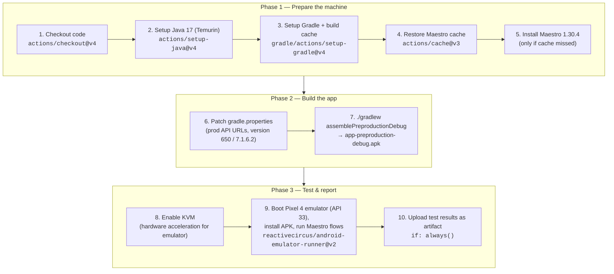
#### Phase 1 — Prepare the machine
| Step | What it does | Why |
|---|---|---|
| **Enable KVM** (`run:` + `udev` rules) | Grants all users access to `/dev/kvm` | KVM = hardware virtualization. Without it the Android emulator runs in pure software emulation and is unusably slow |
| **Run Maestro E2E tests** (`reactivecircus/android-emulator-runner@v2`) | Boots a headless **Pixel 4, API 33, x86_64** emulator (4 cores, 4 GB RAM, no window/audio/animations), then runs the `script:` inside it: `adb install` the APK, verify it's installed, and execute `Development/.maestro/run_maestro.sh` with tags `onboarding,home,job_detail,main_list,my_activity_page,profile_page,profile_edit,resume` | This is the heart of the workflow. One community action encapsulates the very fiddly work of creating an AVD, booting it, and waiting for it to be ready. The tags select which Maestro flow suites to run |
| **Upload Maestro Test Results** (`actions/upload-artifact@v4`) | Zips everything under `Development/.maestro/tests/**` into an artifact named `maestro-results`, kept for 7 days. **`if: always()`** | `if: always()` is crucial: by default steps are skipped once something fails — but a *failed* test run is exactly when you most need the reports and screenshots. This guarantees you can always download the evidence |
---
## 6. The full journey of our Maestro workflow
End-to-end, including the failure path:
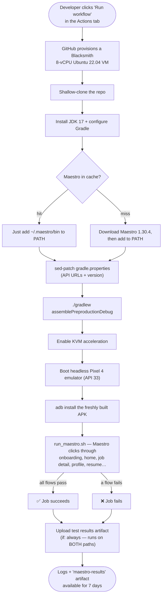
---
## 7. Expressions, contexts, and variables
Workflows aren't static text — GitHub evaluates **expressions** written as `${{ … }}` before/while running. Our file uses several:
| Expression in our workflow | Context it reads | Meaning |
|---|---|---|
| `${{ github.ref != 'refs/heads/main' }}` | `github` — info about the event/repo | "Is this run *not* on the `main` branch?" → used to make the Gradle cache read-only off-`main` |
| `${{ runner.os }}` | `runner` — info about the VM | Resolves to `Linux`; part of the Maestro cache key so an OS change invalidates the cache |
Other commonly used contexts you'll meet:
- `${{ secrets.MY_TOKEN }}` — encrypted repository/organization secrets (API keys, signing keys). Never printed in logs.
- `${{ github.event_name }}`, `${{ github.actor }}`, `${{ github.sha }}` — what triggered the run, who, and which commit.
- `${{ env.SOMETHING }}` — environment variables defined with `env:`.
There are also **special files** for talking to the runner from shell scripts:
- `echo "some/dir" >> "$GITHUB_PATH"` — prepend to `PATH` for subsequent steps (our Maestro install step does this).
- `echo "KEY=value" >> "$GITHUB_ENV"` — set an env var for subsequent steps.
---
## 8. Caching — why our builds are fast
A fresh VM means nothing survives between runs — downloads and compilation would repeat every time. Caching fixes that. We use **two independent caches**:
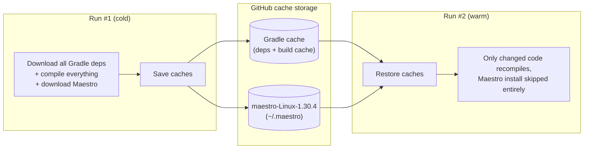
1. **Gradle cache** — managed automatically by `gradle/actions/setup-gradle@v4`. Combined with `--build-cache` and `GRADLE_OPTS`, unchanged modules aren't recompiled. The `cache-read-only` guard means only `main` runs update the shared cache.
2. **Maestro cache** — `actions/cache@v3` with key `maestro-${{ runner.os }}-1.30.4`. The version number is baked into the key, so bumping Maestro to a new version automatically misses the old cache and triggers a fresh install.
> **Cache vs. artifact:** a *cache* is an optimization between runs (may be evicted, keyed lookup). An *artifact* is an output of a run you want to keep and download (test reports, APKs).
---
## 9. Artifacts — getting results out
The runner VM is destroyed after the job — anything not uploaded is gone. Our last step:
```yaml
- name: Upload Maestro Test Results
  if: always()
  uses: actions/upload-artifact@v4
  with:
    name: maestro-results
    path: |
      Development/.maestro/tests/**
    retention-days: 7
    if-no-files-found: warn
```
- Downloadable from the run's **Summary page** in the Actions tab (a zip named `maestro-results`).
- `retention-days: 7` — auto-deleted after a week to save storage.
- `if-no-files-found: warn` — don't fail the whole run just because no reports were produced (e.g., the build failed before tests started); just print a warning.
- `if: always()` — upload even when earlier steps failed (see §5.4).
---
## 10. Triggers you could add next
Today the suite is manual-only. The `on:` block supports many other events — some natural next steps for this repo:
```yaml
on:
  workflow_dispatch:          # keep the manual button
  pull_request:               # run automatically on every PR into develop
    branches: [develop]
  schedule:                   # nightly run at 02:00 UTC (cron syntax)
    - cron: "0 2 * * *"
  push:
    tags: ["v*"]              # run when a release tag like v7.1.7 is pushed
```
You can also add **inputs** to `workflow_dispatch` (like Jenkins parameters — see next section), e.g. letting the person triggering the run choose which Maestro tags to execute:
```yaml
on:
  workflow_dispatch:
    inputs:
      tags:
        description: "Comma-separated Maestro tags to run"
        default: "onboarding,home"
        required: true
# …then reference it as ${{ inputs.tags }} in the test step
```
Other useful features not yet used here: multiple parallel jobs with `needs:` dependencies, `matrix:` builds (e.g., test on API 30 *and* 33 simultaneously), `secrets` for signing keys, and `concurrency:` to cancel superseded runs.
---
## 11. GitHub Actions vs. our Jenkins pipelines
This repo also contains `Development/JenkinsfileProd` and `Development/JenkinsfileStag` — Jenkins pipelines used for Play Store releases. Same idea (pipeline-as-code), different platform:
| Aspect | GitHub Actions (`maestro-test-suit.yml`) | Jenkins (`JenkinsfileProd`) |
|---|---|---|
| Where it runs | Cloud runners provisioned per run | A Jenkins server/agents we host and maintain |
| Definition language | YAML | Groovy DSL |
| Trigger | GitHub events (here: manual dispatch) | Jenkins UI / webhooks |
| Parameters | `workflow_dispatch` `inputs:` | `parameters { string(...) choice(...) }` |
| Reuse mechanism | Marketplace actions (`uses:`) | Jenkins plugins + shared libraries |
| Infrastructure upkeep | None (managed) | Ours to patch, scale, secure |
| Integration with PRs | Native (checks, required status) | Via plugins/webhooks |
Interestingly, both do the exact same `sed` trick on `gradle.properties` before building — the same release-engineering logic, expressed in two systems.
---
## 12. Cheat sheet
```yaml
name: <workflow name>            # shown in the Actions tab
on: <events>                     # what starts it: push / pull_request /
                                 # workflow_dispatch / schedule / …
env:                             # variables for all jobs & steps
  KEY: value
jobs:
  <job_id>:
    runs-on: <runner label>      # which machine
    timeout-minutes: <n>         # kill switch
    steps:
      - name: <human label>
        uses: <owner/action@vN>  # reusable action …
        with: { key: value }     #   … configured via inputs
      - name: <human label>
        run: <shell commands>    # or raw shell
        working-directory: <dir>
        if: always()             # condition (always / success / failure / expression)
```
**Where to look when something fails:**
1. Repo → **Actions** tab → click the red run.
2. Click the failing job → expand the failing step → read the log.
3. Download the `maestro-results` artifact from the run summary for screenshots/reports of the failed flows.
**Official docs:** [docs.github.com/actions](https://docs.github.com/en/actions) · Workflow syntax reference: [docs.github.com/actions/reference/workflow-syntax-for-github-actions](https://docs.github.com/en/actions/using-workflows/workflow-syntax-for-github-actions)


# Jenkins, Fastlane & Maestro — What, How and Why
A tool-by-tool guide to the three pillars of a modern mobile CI/CD + testing setup. Each section answers three questions: **What is it? How does it work? Why do we need it?**
---
## The 30-Second Overview
These three tools solve three different problems, and they compose into one pipeline:
| Tool | Category | Problem it solves | One-liner |
|---|---|---|---|
| **Jenkins** | CI/CD Server (Orchestrator) | "Who runs the automation, when, and where?" | A self-hosted automation server that triggers and runs jobs (build, test, deploy) on code events or schedules |
| **Fastlane** | Build & Release Automation | "How do I build, sign and ship my app without 50 manual steps?" | A Ruby-based toolchain that scripts the entire mobile build/sign/upload workflow into one command |
| **Maestro** | Mobile UI Testing | "Does my app actually work when a human taps through it?" | A declarative (YAML) UI testing framework that drives a real app on an emulator/device like a user would |
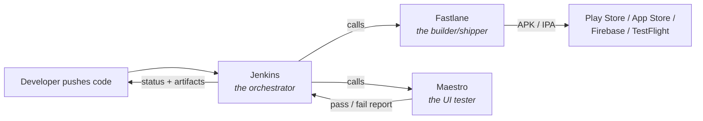
> **Mental model:** Jenkins is the *factory manager*, Fastlane is the *assembly line*, Maestro is the *quality inspector*.
---
## 1. Jenkins
### What is it?
Jenkins is an **open-source automation server** written in Java. It's one of the oldest and most widely used CI/CD (Continuous Integration / Continuous Delivery) tools. You host it yourself (on a VM, bare metal, or Kubernetes), and it runs "jobs" — arbitrary sequences of steps like *checkout code → build → test → deploy*.
Key vocabulary:
- **Controller (master):** the brain — serves the web UI, schedules jobs, stores config.
- **Agent (node/worker):** the muscle — a machine where jobs actually execute. A Mac agent for iOS builds, a Linux agent for Android builds, etc.
- **Job / Pipeline:** a defined unit of automation.
- **Jenkinsfile:** a text file (Groovy DSL) checked into your repo that describes the pipeline as code.
- **Plugin:** Jenkins's superpower and curse — 1,800+ plugins integrate it with Git, Slack, Docker, Android SDK, everything.
### How does it work?
1. **A trigger fires** — a push/PR webhook from GitHub/GitLab, a cron schedule (nightly build), another job finishing, or a human clicking "Build Now".
2. **The controller schedules the job** onto an agent that has the right labels (e.g. `android`, `mac-mini-ios`).
3. **The agent executes the pipeline stages** defined in the Jenkinsfile — each stage is a shell command, a script, or a plugin step.
4. **Results are reported back** — console logs, test reports, build artifacts (APK/IPA), and notifications (Slack/email).
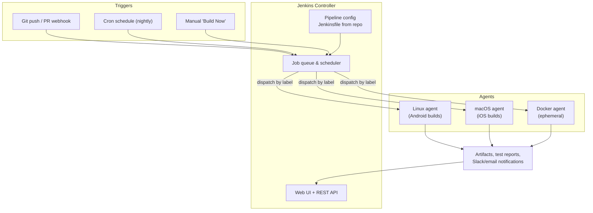
A minimal declarative **Jenkinsfile** for a mobile app looks like this:
```groovy
pipeline {
    agent { label 'android' }
    stages {
        stage('Checkout') {
            steps { checkout scm }
        }
        stage('Unit Tests') {
            steps { sh './gradlew testDebugUnitTest' }
        }
        stage('Build') {
            steps { sh 'bundle exec fastlane build_release' }   // 👈 Jenkins delegates to Fastlane
        }
        stage('UI Tests') {
            steps { sh 'maestro test .maestro/' }               // 👈 Jenkins delegates to Maestro
        }
        stage('Distribute') {
            when { branch 'main' }
            steps { sh 'bundle exec fastlane deploy_beta' }
        }
    }
    post {
        always  { junit '**/test-results/**/*.xml' }
        failure { slackSend channel: '#builds', message: "Build failed: ${env.BUILD_URL}" }
    }
}
```
### Why use it?
- **Automation of repetition:** no human should run builds/tests by hand on every commit. Machines don't forget steps.
- **Fast feedback:** a broken commit is flagged in minutes, not discovered days later by a teammate.
- **Single source of truth:** every build is reproducible, logged, numbered and auditable. "It works on my machine" dies here.
- **Self-hosted control:** unlike GitHub Actions / Bitrise cloud runners, you own the hardware. Crucial for iOS (needs macOS machines), for private networks, and for cost control at scale.
- **Infinitely extensible:** plugins + arbitrary shell steps mean it can orchestrate *anything* — which is exactly why it's the layer that calls Fastlane and Maestro rather than replacing them.
**Trade-offs to know:** you maintain it yourself (upgrades, plugins, agent machines), the UI is dated, and Groovy pipelines have a learning curve. Cloud alternatives (GitHub Actions, GitLab CI, Bitrise, CircleCI) trade control for convenience.
---
## 2. Fastlane
### What is it?
Fastlane is an **open-source build & release automation toolchain for mobile apps** (Android and iOS), written in Ruby and now maintained under the Mobile Native Foundation. It packages the dozens of fiddly steps between "code compiles" and "app is in users' hands" into scriptable, repeatable commands called **lanes**.
Key vocabulary:
- **Fastfile:** the Ruby file where you define your lanes (lives in `fastlane/` in your repo).
- **Lane:** a named workflow, e.g. `beta`, `release`, `screenshots`.
- **Action:** a built-in step — Fastlane ships 200+ (e.g. `gradle`, `gym`, `match`, `supply`, `pilot`, `slack`).
- **Appfile / Matchfile / etc.:** config files for app identifiers, signing, credentials.
The famous actions by nickname:
| Action | Alias | What it does |
|---|---|---|
| `build_ios_app` | `gym` | Builds & archives the iOS app (IPA) |
| `build_android_app` | `gradle` | Runs Gradle tasks, produces APK/AAB |
| `sync_code_signing` | `match` | Manages iOS certificates & provisioning profiles in a shared encrypted repo |
| `upload_to_play_store` | `supply` | Publishes AAB + metadata to Google Play |
| `upload_to_testflight` | `pilot` | Uploads builds to TestFlight |
| `capture_screenshots` | `snapshot` / `screengrab` | Automates store screenshots on many devices/locales |
| `run_tests` | `scan` | Runs unit/UI test suites |
### How does it work?
You describe a workflow once in the **Fastfile**, then anyone (a developer locally, or Jenkins in CI) runs it with one command: `fastlane android beta`.
```ruby
# fastlane/Fastfile
default_platform(:android)
platform :android do
  desc "Build a release AAB and ship it to internal testers"
  lane :beta do
    gradle(task: "clean")                       # 1. clean
    gradle(                                     # 2. build + sign
      task: "bundle",
      build_type: "Release",
      properties: {
        "android.injected.signing.store.file" => ENV["KEYSTORE_PATH"],
        "android.injected.signing.store.password" => ENV["KEYSTORE_PASSWORD"],
      }
    )
    upload_to_play_store(track: "internal")     # 3. upload
    slack(message: "New internal build is live 🎉")  # 4. notify
  end
  ```
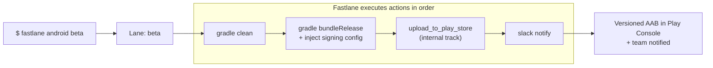
For iOS, the flow it automates is even more painful manually — certificates, provisioning profiles, archiving, export options, App Store Connect uploads:
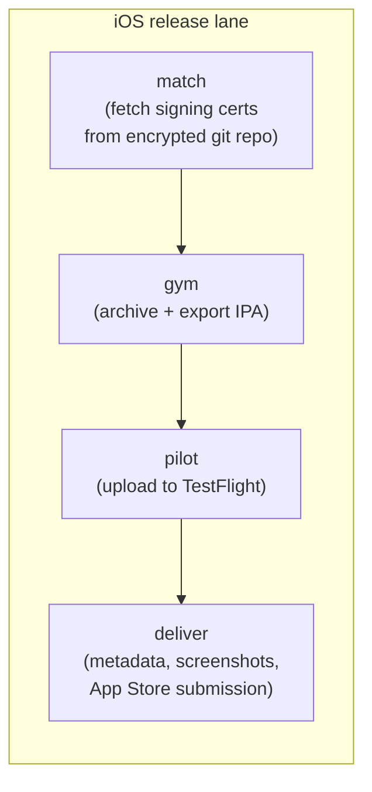
### Why use it?
- **Kills manual release checklists:** a release that took a person 1–2 hours of clicking through Android Studio / Xcode / Play Console / App Store Connect becomes a single command.
- **Removes human error:** signing configs, version bumps, changelogs, upload tracks — all codified. The #1 source of broken releases is a skipped manual step.
- **Same command locally and in CI:** Jenkins runs the exact lane a developer would run on their laptop, so there's no divergence between "CI builds" and "local builds".
- **Solves iOS code-signing hell:** `match` puts certificates/profiles in one encrypted repo shared by the whole team and CI, ending the "works on Priya's Mac but not the build machine" problem.
- **Cross-platform in one tool:** one mental model for both Android and iOS release pipelines.
**Trade-offs to know:** it's Ruby (dependency management via Bundler adds friction), and Apple/Google API changes occasionally break actions until the community patches them. But it remains the de-facto standard.
---
## 3. Maestro
### What is it?
Maestro is an **open-source mobile UI testing framework** (by mobile.dev). You write test *flows* in simple **YAML** — "launch the app, tap Login, type an email, assert the home screen is visible" — and Maestro executes them against a real running app on an emulator, simulator, or physical device. It supports Android, iOS, React Native, Flutter, and even Web views.
It competes with / replaces tools like Espresso (Android), XCUITest (iOS), Appium, and Detox — but with a very different philosophy: **black-box, declarative, and tolerant of flakiness by design**.
Key vocabulary:
- **Flow:** a single YAML file describing one user journey (e.g. `login.yaml`).
- **Commands:** steps inside a flow — `tapOn`, `inputText`, `assertVisible`, `scroll`, `swipe`, `runFlow` (compose flows).
- **Maestro Studio:** an interactive tool that inspects your app's screen and helps you write selectors.
- **Maestro Cloud:** optional paid service to run flows on hosted devices at scale.
### How does it work?
1. You start an emulator/simulator with your app installed (the APK Fastlane just built, for instance).
2. Maestro connects to the device, launches the app, and reads the **view hierarchy** (accessibility tree) of the current screen.
3. Each YAML command is matched against that hierarchy — by visible text, accessibility ID, or regex.
4. **Built-in smart waiting:** Maestro automatically retries/waits for elements to appear and for the UI to settle, which eliminates most `sleep()`-style flakiness that plagues other frameworks.
5. Results (pass/fail, screenshots, recordings, logs) are written out — perfect for a CI report.
A real flow file:
```yaml
# .maestro/login.yaml
appId: com.example.myapp
---
- launchApp:
    clearState: true
- tapOn: "Log in"
- tapOn:
    id: "email_input"
- inputText: "test@example.com"
- tapOn:
    id: "password_input"
- inputText: "s3cret!"
- tapOn: "Continue"
- assertVisible: "Welcome back"     # test passes only if home screen shows
- takeScreenshot: login_success
```
Run it with: `maestro test .maestro/login.yaml` (or a whole folder: `maestro test .maestro/`).
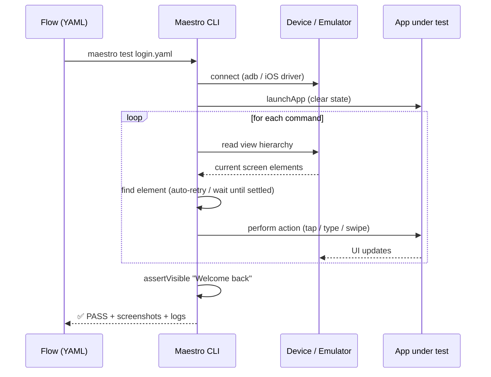
### Why use it?
- **Tests what users actually experience:** unit tests prove your logic works; only UI tests prove the *app* works — that the button is visible, tappable, and leads somewhere.
- **YAML = low barrier to entry:** QA engineers and even PMs can read and write flows. No Kotlin/Swift test APIs, no Appium driver setup, no waiting-strategy boilerplate.
- **Anti-flakiness by design:** auto-waiting and retries are built in. Flaky UI tests are the #1 reason teams abandon UI testing; Maestro was built specifically to fix that.
- **Black-box & cross-platform:** it doesn't need your app's source code or test hooks — it drives the binary. One tool and one syntax for Android *and* iOS.
- **Fast iteration:** `maestro studio` lets you inspect the live screen and try commands interactively; flows are hot-reloaded during development.
**Trade-offs to know:** UI tests are inherently slower than unit tests (seconds per step, need a device), and black-box testing can't easily assert internal state — keep the suite focused on critical user journeys (login, core purchase/apply flow, onboarding), not every edge case.
---
## How the Three Fit Together
Each tool stays in its lane (pun intended). A typical end-to-end pipeline for a mobile release:
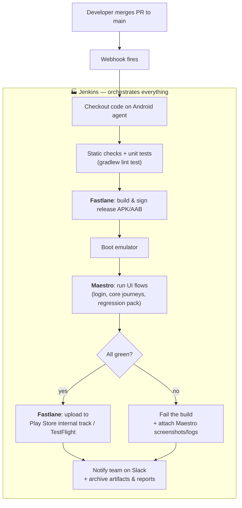
The division of responsibility, spelled out:
| Question | Answered by |
|---|---|
| *When* should this run? (every push? nightly? on release tags?) | **Jenkins** (triggers) |
| *Where* should it run? (which Mac/Linux machine, which emulator) | **Jenkins** (agents/labels) |
| *How* is the app built, signed, versioned and uploaded? | **Fastlane** (lanes) |
| *Does* the built app actually work for a user? | **Maestro** (flows) |
| *Who* gets told about the result, and where do artifacts live? | **Jenkins** (post steps, notifications) |
### Why not just one tool?
Because they operate at different layers, and each is replaceable independently:
- Swap **Jenkins** for GitHub Actions or Bitrise → your Fastfile and Maestro flows don't change at all.
- Swap **Fastlane** for raw Gradle/Xcode scripts → Jenkins stages and Maestro flows are untouched.
- Swap **Maestro** for Appium/Espresso → build and orchestration layers are untouched.
That loose coupling — orchestrator, builder, tester as separate tools glued by shell commands — is the whole architectural point.
---
## TL;DR
- **Jenkins** = self-hosted automation server. It watches your repo, and on every push/schedule, runs your pipeline on the right machine and reports results. *It runs things.*
- **Fastlane** = mobile release automation. One command builds, signs, versions, and uploads your app, identically on a laptop or in CI. *It ships things.*
- **Maestro** = declarative UI testing. YAML flows drive your real app on a device and assert the user experience works, with built-in anti-flakiness. *It verifies things.*
- Together: Jenkins **triggers** → Fastlane **builds & ships** → Maestro **verifies** → Jenkins **reports**.
