# GitHub Actions & Workflows — What, Why, and How
> This document explains GitHub Actions from the ground up, using **this repository's own workflow** — [`.github/workflows/maestro-test-suit.yml`](../.github/workflows/maestro-test-suit.yml) — as the running example. That workflow builds the WorkIndia Android app and runs Maestro end-to-end (E2E) tests on an Android emulator.

## 1. What is GitHub Actions?
**GitHub Actions is GitHub's built-in CI/CD (Continuous Integration / Continuous Delivery) platform.** It lets you run automated tasks — building code, running tests, releasing apps — directly from your repository, triggered by events that happen on GitHub (a push, a pull request, a button click, a schedule, …).
Everything is described in **YAML files** that live inside the repository under:
```text
.github/
└── workflows/
    └── maestro-test-suit.yml   ← our only workflow (for now)
```
Because the automation is *versioned alongside the code*, a change to the build process is reviewed in a pull request just like any other code change.
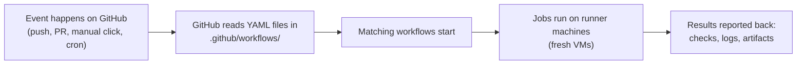
---
## 2. Why do we use it?
| Problem without CI | How GitHub Actions solves it |
|---|---|
| "It works on my machine" — builds behave differently per developer | Every run starts on a **fresh, identical virtual machine**, so results are reproducible |
| Manual testing is slow and easy to forget | Tests run **automatically** on every trigger; nobody has to remember |
| Broken code gets merged unnoticed | A failing workflow shows a red ❌ on the commit/PR, blocking merges if you want |
| Release steps are tribal knowledge in someone's head | The whole process is **codified in YAML**, reviewable and versioned |
| Long feedback loops | Runs happen in parallel on cloud machines the moment code changes |
For this repository specifically: building an Android APK, booting an emulator, and clicking through the entire app with Maestro takes a long time and a beefy machine. GitHub Actions gives us an **8-vCPU cloud machine on demand** (`blacksmith-8vcpu-ubuntu-2204`) that does all of it unattended and uploads the test results at the end — even when the tests fail.
---
## 3. The building blocks (concepts & vocabulary)
GitHub Actions has a small hierarchy of concepts. From the outside in:
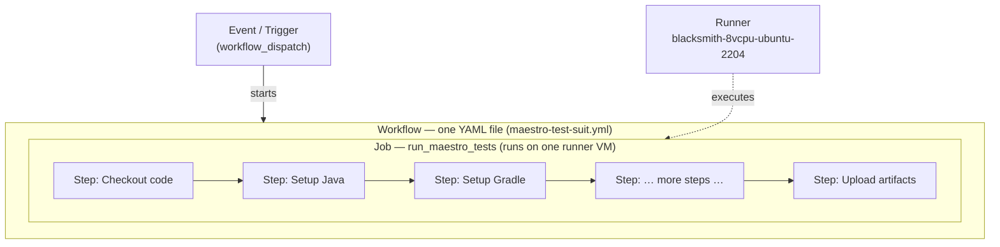
| Term | What it is | In our workflow |
|---|---|---|
| **Event / trigger** | The thing that starts a workflow (`on:`) | `workflow_dispatch` — a manual "Run workflow" button in the Actions tab |
| **Workflow** | One YAML file = one automated process | `Run Maestro Tests` |
| **Job** | A group of steps that runs on **one machine**. Jobs can run in parallel or depend on each other | `run_maestro_tests` (we have a single job) |
| **Runner** | The machine (VM) a job executes on. GitHub-hosted, self-hosted, or third-party | `blacksmith-8vcpu-ubuntu-2204` — a third-party (Blacksmith) high-performance runner |
| **Step** | A single task inside a job. Runs sequentially, shares the same filesystem | "Checkout code", "Build Debug APK", … (10 steps total) |
| **Action** | A **reusable, packaged step** published by GitHub or the community, referenced with `uses:` | `actions/checkout@v4`, `actions/setup-java@v4`, `reactivecircus/android-emulator-runner@v2` |
| **`run:` step** | A step that executes raw shell commands instead of a packaged action | The `sed` commands, `./gradlew assemblePreproductionDebug`, … |
| **Artifact** | Files a job saves so you can download them after the run | `maestro-results` (test reports, kept 7 days) |
| **Cache** | Files persisted **between** runs to speed things up | Gradle build cache + the `~/.maestro` install |
> **Key distinction — `uses:` vs `run:`**
> `uses:` pulls in a pre-built action someone already wrote (like importing a library).
> `run:` executes shell commands you write yourself (like writing your own code).
> A good workflow mixes both: reuse where possible, script where necessary.
---
## 4. How a workflow runs — the big picture
The lifecycle of any GitHub Actions run:
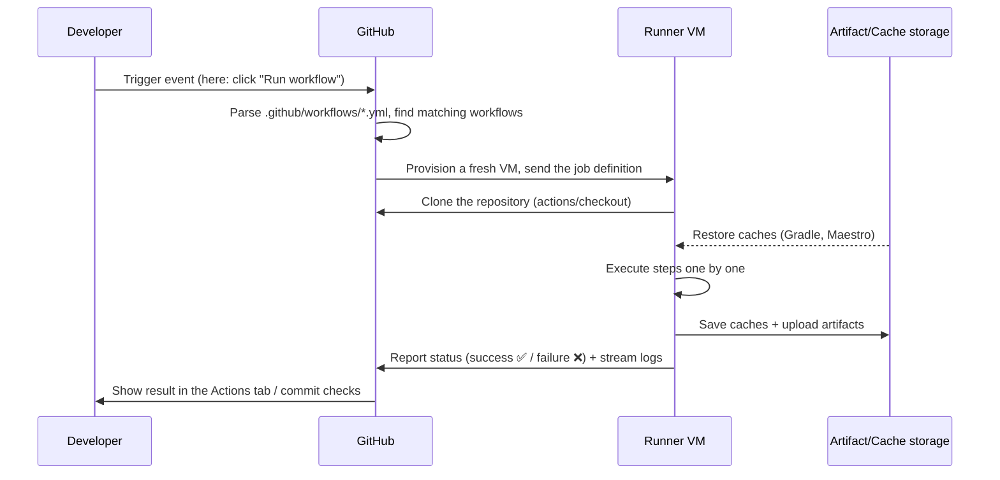
Important properties to internalize:
- **Every run starts from a clean slate.** The runner VM has nothing from previous runs except what you explicitly restore from *cache*.
- **Steps in a job run sequentially and share a filesystem** — that's why our "Build Debug APK" step can install the APK produced two steps earlier.
- **If any step fails, later steps are skipped by default** — unless a step opts out with `if: always()` (ours does, for uploading test results).
- **Logs stream live** — you can watch the emulator boot and tests run in real time from the Actions tab.
---
## 5. Our workflow, dissected line by line
Below is [`maestro-test-suit.yml`](../.github/workflows/maestro-test-suit.yml) explained section by section.
### 5.1 Name and trigger
```yaml
name: Run Maestro Tests
on:
  workflow_dispatch:
```
- `name:` is what shows in the Actions tab sidebar.
- `on: workflow_dispatch:` means this workflow **only runs when a human presses the "Run workflow" button** (GitHub → *Actions* tab → *Run Maestro Tests* → *Run workflow*). Nothing happens automatically on push or PR. This makes sense here because a full E2E suite is expensive (~up to 90 minutes) — you run it deliberately, not on every commit.
### 5.2 Workflow-level environment variables
```yaml
env:
  GRADLE_OPTS: "-Dorg.gradle.daemon=false -Dorg.gradle.parallel=true -Dorg.gradle.caching=true"
```
`env:` at the top level injects environment variables into **every step of every job**. Here we tune Gradle: no long-lived daemon (pointless on a throwaway VM), parallel module builds, and the build cache switched on.
### 5.3 The job definition
```yaml
jobs:
  run_maestro_tests:
    timeout-minutes: 90
    runs-on: blacksmith-8vcpu-ubuntu-2204
```
- `run_maestro_tests` is the job's ID (one job in this workflow).
- `timeout-minutes: 90` — a safety net: if the emulator hangs, the job is killed instead of burning compute forever.
- `runs-on:` selects the runner. Instead of GitHub's stock `ubuntu-latest`, we use a **Blacksmith** 8-vCPU Ubuntu 22.04 machine — Android builds and emulators are CPU/RAM hungry, and this label routes the job to faster third-party hardware.
### 5.4 The steps — three phases
The 10 steps fall into three logical phases:
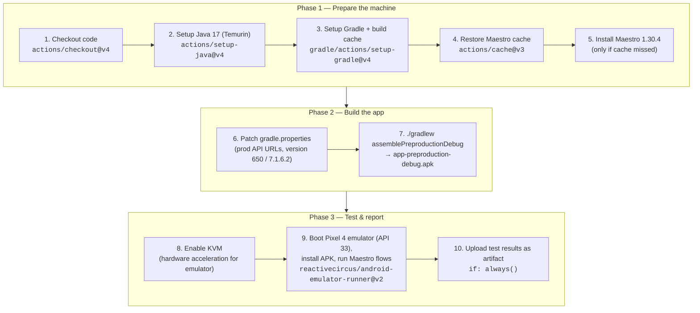
#### Phase 1 — Prepare the machine
| Step | What it does | Why |
|---|---|---|
| **Enable KVM** (`run:` + `udev` rules) | Grants all users access to `/dev/kvm` | KVM = hardware virtualization. Without it the Android emulator runs in pure software emulation and is unusably slow |
| **Run Maestro E2E tests** (`reactivecircus/android-emulator-runner@v2`) | Boots a headless **Pixel 4, API 33, x86_64** emulator (4 cores, 4 GB RAM, no window/audio/animations), then runs the `script:` inside it: `adb install` the APK, verify it's installed, and execute `Development/.maestro/run_maestro.sh` with tags `onboarding,home,job_detail,main_list,my_activity_page,profile_page,profile_edit,resume` | This is the heart of the workflow. One community action encapsulates the very fiddly work of creating an AVD, booting it, and waiting for it to be ready. The tags select which Maestro flow suites to run |
| **Upload Maestro Test Results** (`actions/upload-artifact@v4`) | Zips everything under `Development/.maestro/tests/**` into an artifact named `maestro-results`, kept for 7 days. **`if: always()`** | `if: always()` is crucial: by default steps are skipped once something fails — but a *failed* test run is exactly when you most need the reports and screenshots. This guarantees you can always download the evidence |
---
## 6. The full journey of our Maestro workflow
End-to-end, including the failure path:
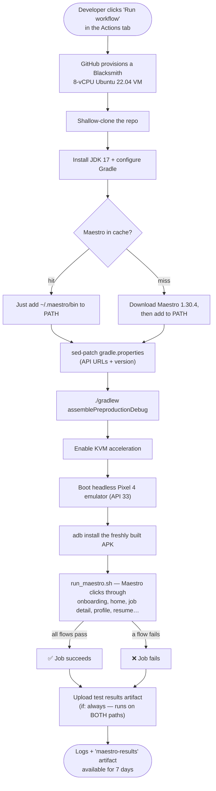
---
## 7. Expressions, contexts, and variables
Workflows aren't static text — GitHub evaluates **expressions** written as `${{ … }}` before/while running. Our file uses several:
| Expression in our workflow | Context it reads | Meaning |
|---|---|---|
| `${{ github.ref != 'refs/heads/main' }}` | `github` — info about the event/repo | "Is this run *not* on the `main` branch?" → used to make the Gradle cache read-only off-`main` |
| `${{ runner.os }}` | `runner` — info about the VM | Resolves to `Linux`; part of the Maestro cache key so an OS change invalidates the cache |
Other commonly used contexts you'll meet:
- `${{ secrets.MY_TOKEN }}` — encrypted repository/organization secrets (API keys, signing keys). Never printed in logs.
- `${{ github.event_name }}`, `${{ github.actor }}`, `${{ github.sha }}` — what triggered the run, who, and which commit.
- `${{ env.SOMETHING }}` — environment variables defined with `env:`.
There are also **special files** for talking to the runner from shell scripts:
- `echo "some/dir" >> "$GITHUB_PATH"` — prepend to `PATH` for subsequent steps (our Maestro install step does this).
- `echo "KEY=value" >> "$GITHUB_ENV"` — set an env var for subsequent steps.
---
## 8. Caching — why our builds are fast
A fresh VM means nothing survives between runs — downloads and compilation would repeat every time. Caching fixes that. We use **two independent caches**:
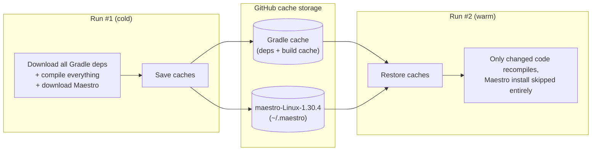
1. **Gradle cache** — managed automatically by `gradle/actions/setup-gradle@v4`. Combined with `--build-cache` and `GRADLE_OPTS`, unchanged modules aren't recompiled. The `cache-read-only` guard means only `main` runs update the shared cache.
2. **Maestro cache** — `actions/cache@v3` with key `maestro-${{ runner.os }}-1.30.4`. The version number is baked into the key, so bumping Maestro to a new version automatically misses the old cache and triggers a fresh install.
> **Cache vs. artifact:** a *cache* is an optimization between runs (may be evicted, keyed lookup). An *artifact* is an output of a run you want to keep and download (test reports, APKs).
---
## 9. Artifacts — getting results out
The runner VM is destroyed after the job — anything not uploaded is gone. Our last step:
```yaml
- name: Upload Maestro Test Results
  if: always()
  uses: actions/upload-artifact@v4
  with:
    name: maestro-results
    path: |
      Development/.maestro/tests/**
    retention-days: 7
    if-no-files-found: warn
```
- Downloadable from the run's **Summary page** in the Actions tab (a zip named `maestro-results`).
- `retention-days: 7` — auto-deleted after a week to save storage.
- `if-no-files-found: warn` — don't fail the whole run just because no reports were produced (e.g., the build failed before tests started); just print a warning.
- `if: always()` — upload even when earlier steps failed (see §5.4).
---
## 10. Triggers you could add next
Today the suite is manual-only. The `on:` block supports many other events — some natural next steps for this repo:
```yaml
on:
  workflow_dispatch:          # keep the manual button
  pull_request:               # run automatically on every PR into develop
    branches: [develop]
  schedule:                   # nightly run at 02:00 UTC (cron syntax)
    - cron: "0 2 * * *"
  push:
    tags: ["v*"]              # run when a release tag like v7.1.7 is pushed
```
You can also add **inputs** to `workflow_dispatch` (like Jenkins parameters — see next section), e.g. letting the person triggering the run choose which Maestro tags to execute:
```yaml
on:
  workflow_dispatch:
    inputs:
      tags:
        description: "Comma-separated Maestro tags to run"
        default: "onboarding,home"
        required: true
# …then reference it as ${{ inputs.tags }} in the test step
```
Other useful features not yet used here: multiple parallel jobs with `needs:` dependencies, `matrix:` builds (e.g., test on API 30 *and* 33 simultaneously), `secrets` for signing keys, and `concurrency:` to cancel superseded runs.
---
## 11. GitHub Actions vs. our Jenkins pipelines
This repo also contains `Development/JenkinsfileProd` and `Development/JenkinsfileStag` — Jenkins pipelines used for Play Store releases. Same idea (pipeline-as-code), different platform:
| Aspect | GitHub Actions (`maestro-test-suit.yml`) | Jenkins (`JenkinsfileProd`) |
|---|---|---|
| Where it runs | Cloud runners provisioned per run | A Jenkins server/agents we host and maintain |
| Definition language | YAML | Groovy DSL |
| Trigger | GitHub events (here: manual dispatch) | Jenkins UI / webhooks |
| Parameters | `workflow_dispatch` `inputs:` | `parameters { string(...) choice(...) }` |
| Reuse mechanism | Marketplace actions (`uses:`) | Jenkins plugins + shared libraries |
| Infrastructure upkeep | None (managed) | Ours to patch, scale, secure |
| Integration with PRs | Native (checks, required status) | Via plugins/webhooks |
Interestingly, both do the exact same `sed` trick on `gradle.properties` before building — the same release-engineering logic, expressed in two systems.
---
## 12. Cheat sheet
```yaml
name: <workflow name>            # shown in the Actions tab
on: <events>                     # what starts it: push / pull_request /
                                 # workflow_dispatch / schedule / …
env:                             # variables for all jobs & steps
  KEY: value
jobs:
  <job_id>:
    runs-on: <runner label>      # which machine
    timeout-minutes: <n>         # kill switch
    steps:
      - name: <human label>
        uses: <owner/action@vN>  # reusable action …
        with: { key: value }     #   … configured via inputs
      - name: <human label>
        run: <shell commands>    # or raw shell
        working-directory: <dir>
        if: always()             # condition (always / success / failure / expression)
```
**Where to look when something fails:**
1. Repo → **Actions** tab → click the red run.
2. Click the failing job → expand the failing step → read the log.
3. Download the `maestro-results` artifact from the run summary for screenshots/reports of the failed flows.
**Official docs:** [docs.github.com/actions](https://docs.github.com/en/actions) · Workflow syntax reference: [docs.github.com/actions/reference/workflow-syntax-for-github-actions](https://docs.github.com/en/actions/using-workflows/workflow-syntax-for-github-actions)


## 13. Jenkins, Fastlane & Maestro — What, How and Why
A tool-by-tool guide to the three pillars of a modern mobile CI/CD + testing setup. Each section answers three questions: **What is it? How does it work? Why do we need it?**
---
These three tools solve three different problems, and they compose into one pipeline:
| Tool | Category | Problem it solves | One-liner |
|---|---|---|---|
| **Jenkins** | CI/CD Server (Orchestrator) | "Who runs the automation, when, and where?" | A self-hosted automation server that triggers and runs jobs (build, test, deploy) on code events or schedules |
| **Fastlane** | Build & Release Automation | "How do I build, sign and ship my app without 50 manual steps?" | A Ruby-based toolchain that scripts the entire mobile build/sign/upload workflow into one command |
| **Maestro** | Mobile UI Testing | "Does my app actually work when a human taps through it?" | A declarative (YAML) UI testing framework that drives a real app on an emulator/device like a user would |
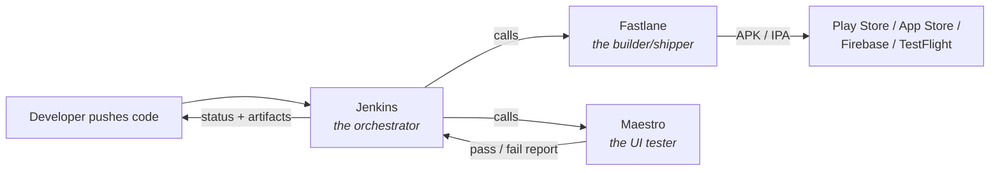
> **Mental model:** Jenkins is the *factory manager*, Fastlane is the *assembly line*, Maestro is the *quality inspector*.
---
### 1. Jenkins
#### What is it?
Jenkins is an **open-source automation server** written in Java. It's one of the oldest and most widely used CI/CD (Continuous Integration / Continuous Delivery) tools. You host it yourself (on a VM, bare metal, or Kubernetes), and it runs "jobs" — arbitrary sequences of steps like *checkout code → build → test → deploy*.
Key vocabulary:
- **Controller (master):** the brain — serves the web UI, schedules jobs, stores config.
- **Agent (node/worker):** the muscle — a machine where jobs actually execute. A Mac agent for iOS builds, a Linux agent for Android builds, etc.
- **Job / Pipeline:** a defined unit of automation.
- **Jenkinsfile:** a text file (Groovy DSL) checked into your repo that describes the pipeline as code.
- **Plugin:** Jenkins's superpower and curse — 1,800+ plugins integrate it with Git, Slack, Docker, Android SDK, everything.
#### How does it work?
1. **A trigger fires** — a push/PR webhook from GitHub/GitLab, a cron schedule (nightly build), another job finishing, or a human clicking "Build Now".
2. **The controller schedules the job** onto an agent that has the right labels (e.g. `android`, `mac-mini-ios`).
3. **The agent executes the pipeline stages** defined in the Jenkinsfile — each stage is a shell command, a script, or a plugin step.
4. **Results are reported back** — console logs, test reports, build artifacts (APK/IPA), and notifications (Slack/email).
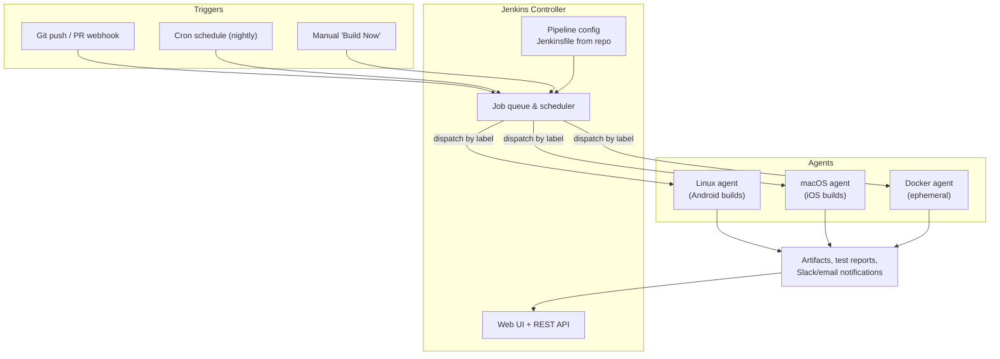
A minimal declarative **Jenkinsfile** for a mobile app looks like this:
```groovy
pipeline {
    agent { label 'android' }
    stages {
        stage('Checkout') {
            steps { checkout scm }
        }
        stage('Unit Tests') {
            steps { sh './gradlew testDebugUnitTest' }
        }
        stage('Build') {
            steps { sh 'bundle exec fastlane build_release' }   // 👈 Jenkins delegates to Fastlane
        }
        stage('UI Tests') {
            steps { sh 'maestro test .maestro/' }               // 👈 Jenkins delegates to Maestro
        }
        stage('Distribute') {
            when { branch 'main' }
            steps { sh 'bundle exec fastlane deploy_beta' }
        }
    }
    post {
        always  { junit '**/test-results/**/*.xml' }
        failure { slackSend channel: '#builds', message: "Build failed: ${env.BUILD_URL}" }
    }
}
```
#### Why use it?
- **Automation of repetition:** no human should run builds/tests by hand on every commit. Machines don't forget steps.
- **Fast feedback:** a broken commit is flagged in minutes, not discovered days later by a teammate.
- **Single source of truth:** every build is reproducible, logged, numbered and auditable. "It works on my machine" dies here.
- **Self-hosted control:** unlike GitHub Actions / Bitrise cloud runners, you own the hardware. Crucial for iOS (needs macOS machines), for private networks, and for cost control at scale.
- **Infinitely extensible:** plugins + arbitrary shell steps mean it can orchestrate *anything* — which is exactly why it's the layer that calls Fastlane and Maestro rather than replacing them.
**Trade-offs to know:** you maintain it yourself (upgrades, plugins, agent machines), the UI is dated, and Groovy pipelines have a learning curve. Cloud alternatives (GitHub Actions, GitLab CI, Bitrise, CircleCI) trade control for convenience.
---
### 2. Fastlane
#### What is it?
Fastlane is an **open-source build & release automation toolchain for mobile apps** (Android and iOS), written in Ruby and now maintained under the Mobile Native Foundation. It packages the dozens of fiddly steps between "code compiles" and "app is in users' hands" into scriptable, repeatable commands called **lanes**.
Key vocabulary:
- **Fastfile:** the Ruby file where you define your lanes (lives in `fastlane/` in your repo).
- **Lane:** a named workflow, e.g. `beta`, `release`, `screenshots`.
- **Action:** a built-in step — Fastlane ships 200+ (e.g. `gradle`, `gym`, `match`, `supply`, `pilot`, `slack`).
- **Appfile / Matchfile / etc.:** config files for app identifiers, signing, credentials.
The famous actions by nickname:
| Action | Alias | What it does |
|---|---|---|
| `build_ios_app` | `gym` | Builds & archives the iOS app (IPA) |
| `build_android_app` | `gradle` | Runs Gradle tasks, produces APK/AAB |
| `sync_code_signing` | `match` | Manages iOS certificates & provisioning profiles in a shared encrypted repo |
| `upload_to_play_store` | `supply` | Publishes AAB + metadata to Google Play |
| `upload_to_testflight` | `pilot` | Uploads builds to TestFlight |
| `capture_screenshots` | `snapshot` / `screengrab` | Automates store screenshots on many devices/locales |
| `run_tests` | `scan` | Runs unit/UI test suites |
#### How does it work?
You describe a workflow once in the **Fastfile**, then anyone (a developer locally, or Jenkins in CI) runs it with one command: `fastlane android beta`.
```ruby
# fastlane/Fastfile
default_platform(:android)
platform :android do
  desc "Build a release AAB and ship it to internal testers"
  lane :beta do
    gradle(task: "clean")                       # 1. clean
    gradle(                                     # 2. build + sign
      task: "bundle",
      build_type: "Release",
      properties: {
        "android.injected.signing.store.file" => ENV["KEYSTORE_PATH"],
        "android.injected.signing.store.password" => ENV["KEYSTORE_PASSWORD"],
      }
    )
    upload_to_play_store(track: "internal")     # 3. upload
    slack(message: "New internal build is live 🎉")  # 4. notify
  end
  ```
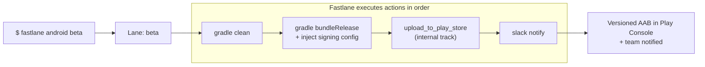
For iOS, the flow it automates is even more painful manually — certificates, provisioning profiles, archiving, export options, App Store Connect uploads:
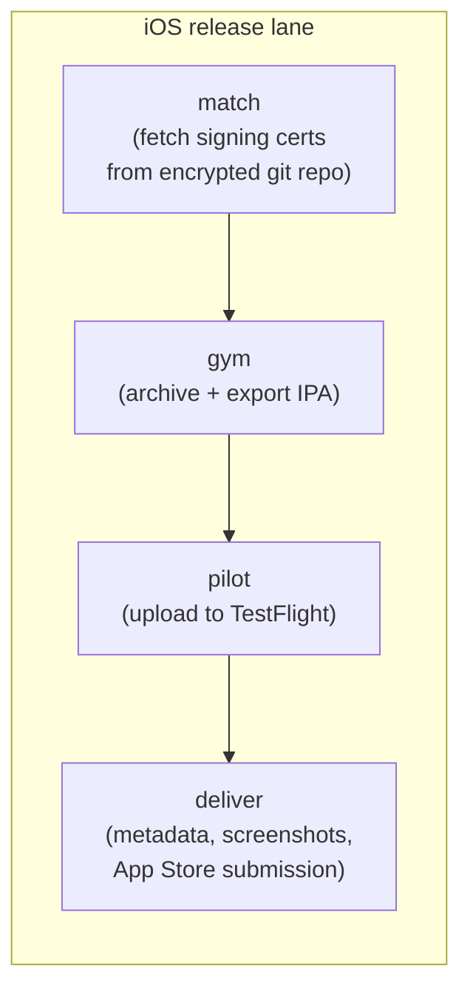
#### Why use it?
- **Kills manual release checklists:** a release that took a person 1–2 hours of clicking through Android Studio / Xcode / Play Console / App Store Connect becomes a single command.
- **Removes human error:** signing configs, version bumps, changelogs, upload tracks — all codified. The #1 source of broken releases is a skipped manual step.
- **Same command locally and in CI:** Jenkins runs the exact lane a developer would run on their laptop, so there's no divergence between "CI builds" and "local builds".
- **Solves iOS code-signing hell:** `match` puts certificates/profiles in one encrypted repo shared by the whole team and CI, ending the "works on Priya's Mac but not the build machine" problem.
- **Cross-platform in one tool:** one mental model for both Android and iOS release pipelines.
**Trade-offs to know:** it's Ruby (dependency management via Bundler adds friction), and Apple/Google API changes occasionally break actions until the community patches them. But it remains the de-facto standard.
---
### 3. Maestro
#### What is it?
Maestro is an **open-source mobile UI testing framework** (by mobile.dev). You write test *flows* in simple **YAML** — "launch the app, tap Login, type an email, assert the home screen is visible" — and Maestro executes them against a real running app on an emulator, simulator, or physical device. It supports Android, iOS, React Native, Flutter, and even Web views.
It competes with / replaces tools like Espresso (Android), XCUITest (iOS), Appium, and Detox — but with a very different philosophy: **black-box, declarative, and tolerant of flakiness by design**.
Key vocabulary:
- **Flow:** a single YAML file describing one user journey (e.g. `login.yaml`).
- **Commands:** steps inside a flow — `tapOn`, `inputText`, `assertVisible`, `scroll`, `swipe`, `runFlow` (compose flows).
- **Maestro Studio:** an interactive tool that inspects your app's screen and helps you write selectors.
- **Maestro Cloud:** optional paid service to run flows on hosted devices at scale.
#### How does it work?
1. You start an emulator/simulator with your app installed (the APK Fastlane just built, for instance).
2. Maestro connects to the device, launches the app, and reads the **view hierarchy** (accessibility tree) of the current screen.
3. Each YAML command is matched against that hierarchy — by visible text, accessibility ID, or regex.
4. **Built-in smart waiting:** Maestro automatically retries/waits for elements to appear and for the UI to settle, which eliminates most `sleep()`-style flakiness that plagues other frameworks.
5. Results (pass/fail, screenshots, recordings, logs) are written out — perfect for a CI report.
A real flow file:
```yaml
# .maestro/login.yaml
appId: com.example.myapp
---
- launchApp:
    clearState: true
- tapOn: "Log in"
- tapOn:
    id: "email_input"
- inputText: "test@example.com"
- tapOn:
    id: "password_input"
- inputText: "s3cret!"
- tapOn: "Continue"
- assertVisible: "Welcome back"     # test passes only if home screen shows
- takeScreenshot: login_success
```
Run it with: `maestro test .maestro/login.yaml` (or a whole folder: `maestro test .maestro/`).
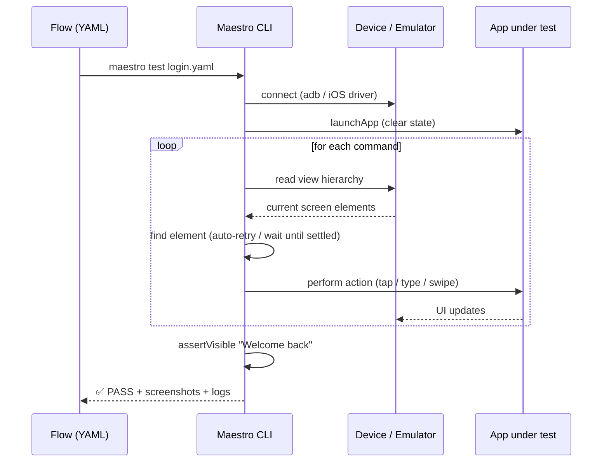
#### Why use it?
- **Tests what users actually experience:** unit tests prove your logic works; only UI tests prove the *app* works — that the button is visible, tappable, and leads somewhere.
- **YAML = low barrier to entry:** QA engineers and even PMs can read and write flows. No Kotlin/Swift test APIs, no Appium driver setup, no waiting-strategy boilerplate.
- **Anti-flakiness by design:** auto-waiting and retries are built in. Flaky UI tests are the #1 reason teams abandon UI testing; Maestro was built specifically to fix that.
- **Black-box & cross-platform:** it doesn't need your app's source code or test hooks — it drives the binary. One tool and one syntax for Android *and* iOS.
- **Fast iteration:** `maestro studio` lets you inspect the live screen and try commands interactively; flows are hot-reloaded during development.
**Trade-offs to know:** UI tests are inherently slower than unit tests (seconds per step, need a device), and black-box testing can't easily assert internal state — keep the suite focused on critical user journeys (login, core purchase/apply flow, onboarding), not every edge case.
---
#### How the Three Fit Together
Each tool stays in its lane (pun intended). A typical end-to-end pipeline for a mobile release:
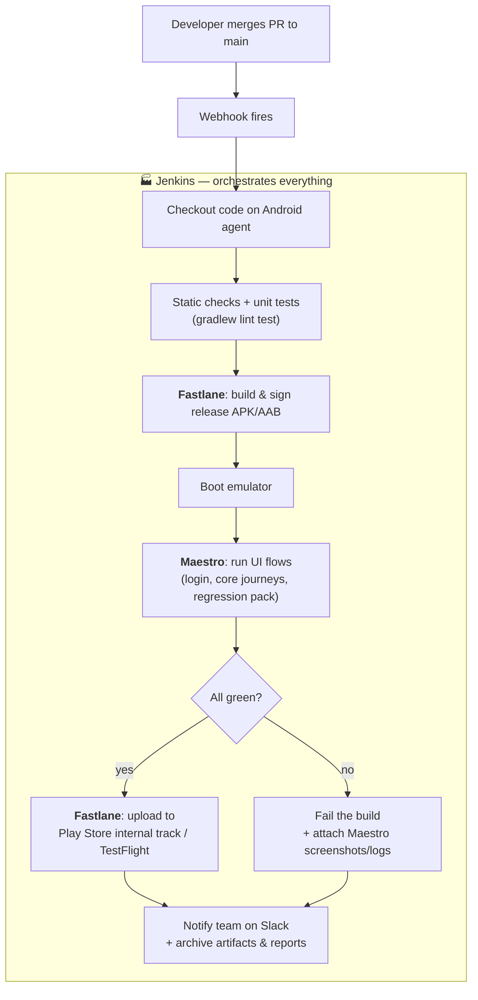
The division of responsibility, spelled out:
| Question | Answered by |
|---|---|
| *When* should this run? (every push? nightly? on release tags?) | **Jenkins** (triggers) |
| *Where* should it run? (which Mac/Linux machine, which emulator) | **Jenkins** (agents/labels) |
| *How* is the app built, signed, versioned and uploaded? | **Fastlane** (lanes) |
| *Does* the built app actually work for a user? | **Maestro** (flows) |
| *Who* gets told about the result, and where do artifacts live? | **Jenkins** (post steps, notifications) |
#### Why not just one tool?
Because they operate at different layers, and each is replaceable independently:
- Swap **Jenkins** for GitHub Actions or Bitrise → your Fastfile and Maestro flows don't change at all.
- Swap **Fastlane** for raw Gradle/Xcode scripts → Jenkins stages and Maestro flows are untouched.
- Swap **Maestro** for Appium/Espresso → build and orchestration layers are untouched.
That loose coupling — orchestrator, builder, tester as separate tools glued by shell commands — is the whole architectural point.
---
## TL;DR
- **Jenkins** = self-hosted automation server. It watches your repo, and on every push/schedule, runs your pipeline on the right machine and reports results. *It runs things.*
- **Fastlane** = mobile release automation. One command builds, signs, versions, and uploads your app, identically on a laptop or in CI. *It ships things.*
- **Maestro** = declarative UI testing. YAML flows drive your real app on a device and assert the user experience works, with built-in anti-flakiness. *It verifies things.*
- Together: Jenkins **triggers** → Fastlane **builds & ships** → Maestro **verifies** → Jenkins **reports**.


## 14. A/B Testing

### What it is

A/B testing (also called split testing) is a method of comparing **two versions of something** — a screen, a button, a headline, a pricing page — by showing each version to a different, randomly-split group of real users, then measuring which one performs better against a specific goal.

- **Version A** = the control (the current/existing version)
- **Version B** = the variant (the new thing you want to test)

Users are split randomly and simultaneously, so both groups experience the same conditions (same time period, same traffic sources, same overall context) — the *only* difference between them is the one thing you changed.

### Why it exists

Without A/B testing, product decisions rely on opinion, intuition, or "the loudest voice in the room." A/B testing replaces "I think this button color converts better" with **actual measured evidence** from real user behavior.

### How it works, step by step

1. **Pick a hypothesis** — a specific, testable belief.
   > "Changing the 'Apply Now' button from blue to orange will increase applications."
2. **Define a success metric** — the one number that decides the winner.
   > e.g., click-through rate, sign-up rate, conversion rate, revenue per user
3. **Split traffic randomly** — e.g., 50% of users see Version A, 50% see Version B, assigned randomly (often via a user ID hash so the same user always sees the same version).
4. **Run the test for a fixed period** — long enough to gather statistically meaningful data (not just a few hours).
5. **Measure results** — compare the success metric between the two groups.
6. **Check statistical significance** — make sure the difference is real and not just random noise/chance.
7. **Ship the winner** — roll out the better-performing version to 100% of users.

### Example

| | Version A (Control) | Version B (Variant) |
|---|---|---|
| Button color | Blue | Orange |
| Users shown | 5,000 | 5,000 |
| Clicked "Apply" | 400 (8%) | 550 (11%) |
| Result | — | **Winner** — statistically significant lift |

### Key concepts

- **Control vs. Variant** — the baseline vs. the thing being tested
- **Sample size** — how many users need to see each version before results are trustworthy (too small a sample = unreliable results)
- **Statistical significance** — a measure of confidence that the observed difference is real, not random luck (commonly expressed as a p-value or confidence level, e.g., 95%)
- **Conversion rate** — the percentage of users who complete the desired action
- **Multivariate testing** — a related technique testing *multiple* changes at once (not just A vs. B), used when you want to test combinations of changes together

### Common use cases

- UI/UX changes (button color, layout, copy)
- Pricing pages
- Onboarding flows
- Email subject lines
- App store listing screenshots
- Notification wording/timing

### Common pitfalls

- **Stopping too early** — ending the test before enough data is collected, leading to false conclusions
- **Testing too many things at once** — makes it unclear which specific change caused the result
- **Ignoring external factors** — holidays, marketing campaigns, or seasonality can skew results if not accounted for
- **Not defining success metrics upfront** — deciding what "winning" means *after* seeing the data is a bias trap (this is sometimes called "p-hacking")


## 15. devctl

### Important caveat first

`devctl` is **not one specific, universal tool** — unlike `gradlew`, `adb`, or `kubectl`, there's no single canonical `devctl` maintained by one organization. It's a **naming convention** ("dev" + "ctl", short for "developer control/controller") that many different companies and open-source projects independently reuse for their own internal developer-facing CLI. If you've encountered a `devctl` somewhere (a company's internal tooling, a repo's README, a script in a codebase), it's almost certainly **that specific team's own custom tool** — worth checking your project's own docs/README rather than assuming it matches a public one.

### Why the name pattern exists

The `xctl` naming style itself comes from Unix convention — "control" a thing, e.g. `systemctl` (control system services), `kubectl` (control a Kubernetes cluster). `devctl` follows that same pattern: **"control your dev environment/workflow from one CLI."**

### What `devctl`-style tools commonly do, across real examples

Even though there's no single tool, most `devctl` implementations converge on the same underlying problem: **"there are 5-10 different manual steps/commands a developer has to remember to set up, run, or manage their environment — wrap them all behind one consistent command."** Common capabilities seen across different real-world `devctl` tools:

| Capability | Example commands |
|---|---|
| Spin up / tear down a dev environment | `devctl dev-up`, `devctl dev-down` |
| Bootstrap a new project/repo from a template | `devctl app bootstrap --name my-app` |
| Manage cloud dev machines (start/stop/snapshot) | `devctl snapshot`, `devctl logs` |
| Generate boilerplate/config files (CI workflows, changelogs) | `devctl gen workflows` |
| Self-service access to internal infra (Vault, K8s, ArgoCD) with permission control | role-based CLI commands, approval workflows |
| Track/estimate cost of cloud resources devs spin up | `devctl do-bill` |
| Update itself / show version | `devctl update`, `devctl --version` |

### Why teams build one at all

Same underlying motivation as everything we've covered in Gradle/CI — **remove manual steps a human has to remember**, replacing them with one consistent entry point:

- **Consistency across the team** — instead of every developer having their own personal shell aliases/scripts for "set up my dev environment," everyone runs the same `devctl` command and gets the same result, on Windows, macOS, or Linux.
- **Reduces onboarding friction** — a new developer doesn't need to read a 10-step wiki page to get a working environment; `devctl dev-up` (or equivalent) does it.
- **Cross-platform consistency** — several real-world `devctl` tools explicitly route everything through a single core (e.g., a Python core with thin wrappers per shell) specifically so behavior doesn't differ between CMD, PowerShell, Bash, and Git Bash.
- **Cost/resource control** — cloud-dev-environment flavors of `devctl` often exist specifically to stop developers from leaving expensive cloud VMs running all day, by making stopping them as easy as one command.
- **Guardrails with permissions (RBAC)** — some `devctl` variants exist specifically to give developers **self-service** access to sensitive infrastructure (secrets vaults, Kubernetes, deployment tools) without just handing out raw credentials — access is routed through the CLI with role checks and audit logging.

### Example: a plausible internal `devctl` for an Android team

If your own team/company has a `devctl`, it likely wraps things you'd otherwise type manually — tying back to concepts from this conversation:

```bash
devctl setup          # installs JDK, Android SDK, sets up local.properties
devctl emulator start # boots a configured emulator (used for Maestro tests, etc.)
devctl build debug    # wraps ./gradlew assembleDebug with any extra env setup
devctl test e2e       # wraps the maestroTest Gradle task from earlier
devctl secrets pull   # fetches dev API keys from a vault instead of hardcoding them
```

None of these commands are "special" — each one is very likely just a thin wrapper shelling out to tools you already know (`./gradlew`, `adb`, `maestro`, a secrets manager CLI) — the value of `devctl` is bundling and standardizing them, not doing anything a single command couldn't already do on its own.

### The one-line summary

`devctl` is a naming pattern, not a specific product — it almost always means **"a custom, team-specific CLI wrapper that bundles together the repetitive setup/build/deploy commands a developer would otherwise have to remember and run manually."** If you've come across one at work, the right move is to read that specific tool's own `--help` output or internal docs, since it's very unlikely to match any public tool by the same name.


## 16. Docker & Jenkins: A Practical Primer

### What is Docker?

Docker is a tool for packaging an application together with **everything it needs to run** — the code, the runtime, system libraries, environment variables, config files — into a single, portable unit called a **container**.

The core idea it solves is the classic problem: *"it works on my machine, but not in CI."* This usually happens because your laptop has a slightly different OS version, a different JDK, different installed tools, or different environment variables than the CI server. Docker eliminates that mismatch by shipping the *exact* environment along with the app, so it behaves identically no matter where it runs — your laptop, a teammate's laptop, or a Jenkins agent.

### Containers vs. Virtual Machines

A common point of confusion: containers are **not** the same as virtual machines.

| | Virtual Machine | Container |
|---|---|---|
| What it virtualizes | Entire hardware + OS kernel | Just the application layer |
| Boot time | Minutes | Seconds |
| Size | GBs (full OS included) | MBs–a few hundred MBs |
| Isolation | Strong (separate kernel) | Process-level (shares host kernel) |

A VM runs a full guest operating system on top of virtualized hardware. A container shares the host machine's OS kernel and just isolates the *application's* filesystem, processes, and network — which is why containers start almost instantly and are far lighter weight than VMs.

## What is a Docker Image?

An **image** is the blueprint. A **container** is a running instance of that blueprint.

Think of it like a class vs. an object in programming:
- The **image** is like a class definition — it describes what should exist (which files, which tools, which base OS, which environment variables).
- The **container** is like an instantiated object — a live, running process based on that image.

You can spin up multiple containers from the same image, just like you can create multiple objects from the same class. Each container gets its own isolated filesystem and process space, but they all start from the same underlying image.

### Where do images come from?

Images are typically defined by a `Dockerfile` — a plain-text recipe listing the steps to build the image (e.g. "start from this base OS, install these packages, copy in this code, set this entry command"). Once built, an image can be:
- Stored locally on a machine
- Pushed to a **registry** (like Docker Hub, or a private registry such as AWS ECR) so other machines can pull and run it

This is exactly what you see in a typical CI build script:

```bash
docker pull 867657578464.dkr.ecr.us-east-1.amazonaws.com/utility/android-fastlane-builder:latest
docker run --rm -v $dir:/src <image-name> /bin/bash -c "cd /src && bundle exec fastlane android prod"
```

Here, `android-fastlane-builder:latest` is the **image** name (pulled from a private ECR registry), and `docker run` creates and starts a **container** from that image to actually execute the build commands.

## Why does Jenkins need Docker?

Jenkins itself is just an automation/orchestration tool — it doesn't inherently know how to build an Android app, run Ruby's Fastlane, or manage specific SDK/JDK versions. Without Docker, you'd have to manually install and maintain the *exact* correct versions of every tool (JDK, Android SDK, Ruby, Bundler, Fastlane, build-tools, etc.) directly on the Jenkins agent machine itself.

That approach causes real problems:

1. **Environment drift** — over time, the Jenkins agent's installed tool versions can silently change (OS updates, manual `apt install`s, plugin upgrades), causing builds to behave differently than before, seemingly "for no reason."
2. **Version conflicts** — if you have multiple projects on the same Jenkins agent needing *different* JDK or Ruby versions, installing them all directly on the host gets messy and conflict-prone fast.
3. **Hard to reproduce locally** — if a build fails on Jenkins, it's difficult for a developer to reproduce the *exact* same environment on their own laptop to debug it.
4. **Fragile agent setup** — the Jenkins agent machine itself becomes a fragile, hand-tuned snowflake that's painful to rebuild or replace if it ever needs to be replicated (e.g., scaling to a second agent).

Docker solves all four:

- The **exact build environment** (JDK version, Android SDK, Ruby, Fastlane, gems, everything) is baked into the image once.
- Jenkins doesn't need any of those tools installed on the host — it just needs Docker itself.
- The **same image** can be pulled and run identically on any machine — a teammate's laptop, a second Jenkins agent, a fresh EC2 instance — with guaranteed identical behavior.
- Debugging a failed build becomes much easier: a developer can `docker pull` and `docker run` the *same* image locally and reproduce the CI environment exactly.

### How this plays out in your pipeline

In the WorkIndia Android pipeline, the flow looks like this:

1. Jenkins checks out the source code from Git onto the agent's workspace.
2. `build.sh` pulls a prebuilt image (`android-fastlane-builder`) from a private AWS ECR registry — this image already has Ruby, Bundler, Fastlane, and the Android build toolchain installed inside it.
3. `docker run` starts a **container** from that image, **bind-mounting** the checked-out source code (`-v $dir:/src`) into the container's filesystem.
4. Inside the container, `bundle exec fastlane android ...` runs the actual Gradle/Fastlane build steps — completely isolated from whatever is or isn't installed on the Jenkins host itself.
5. The container writes build outputs (APKs, mapping files, reports) back into the mounted `/src` directory, which is really just the host's workspace folder — so Jenkins can pick up the results after the container exits.
6. `--rm` tells Docker to automatically delete the container (not the image) once it finishes, keeping things clean.

### A caveat worth knowing: file ownership

Because the container process inside `android-fastlane-builder` typically runs as **root** by default (unless explicitly told otherwise), any files it creates in the bind-mounted workspace end up **owned by root on the host machine** — even though the Jenkins agent itself runs as a regular, non-root user.

This becomes a real problem later: Jenkins' own workspace cleanup step (which runs as its normal non-root user) can fail with "Operation not permitted" when it tries to delete or `chmod` those root-owned files. The fix is either:
- Running the container with `-u $(id -u):$(id -g)` so it uses the host user's UID instead of root, or
- Having the container `chown` the output files back to the host user before exiting

Both approaches prevent orphaned root-owned files from blocking future builds.

## Quick glossary

| Term | Meaning |
|---|---|
| **Image** | An immutable, portable snapshot/blueprint of an environment — OS layer + installed tools + app code |
| **Container** | A running (or stopped) instance of an image — an isolated process with its own filesystem view |
| **Dockerfile** | The recipe/instructions used to build an image |
| **Registry** | A storage/distribution service for images (e.g. Docker Hub, AWS ECR, GitHub Container Registry) |
| **`docker pull`** | Downloads an image from a registry to the local machine |
| **`docker run`** | Creates and starts a new container from a given image |
| **`-v` (volume/bind mount)** | Shares a directory between the host machine and the container |
| **`--rm`** | Automatically deletes the container (not the image) once it exits |

## TL;DR

- **Docker** packages an app with its full environment so it runs identically everywhere.
- An **image** is the static blueprint; a **container** is a live, running instance of that blueprint.
- Jenkins uses Docker so build environments (JDK, SDK, Ruby, Fastlane versions, etc.) stay **consistent, reproducible, and isolated** from whatever is or isn't installed on the Jenkins host itself — instead of hand-maintaining a fragile toolchain directly on the CI machine.


# Shipping a Mobile App — Release Runbook

> Shipping the app is a series of pull requests. You never open an IDE, never touch the
> Play Console, and never pick a version number. This is the whole process, start to
> finish: what each branch does, where each branch is cut from, what the pipeline checks,
> and how to manage a staged rollout.
>
> **This is an anonymised reference copy.** Repository names, Slack channels, version
> numbers and commit hashes are invented. The process and the automation behaviour are real.

| Anonymised name | What it is |
|---|---|
| `mobile-app` | The Android application repository |
| `release-gitops` | Repository holding desired rollout state as YAML |
| `shared-actions` | Shared reusable GitHub Actions |
| `#app-dev-builds` / `#app-qa-builds` / `#app-prod-releases` | Slack channels for build announcements |
| `#release-review` | Slack channel for the pre-merge review process |

---

## 1. What you need

Just a GitHub account with access to two repositories:

| Repository | What you do there |
|---|---|
| [`mobile-app`](https://github.com/example-org/mobile-app) | Merge pull requests. That's what ships the app. |
| [`release-gitops`](https://github.com/example-org/release-gitops) | Adjust a live rollout — widen it or stop it. |

Nothing else. No Android Studio, no SDK, no Play Console login, no signing keys, no local setup of any kind. The build servers fetch the credentials they need and clean up after themselves.

---

## 2. How it works, in three sentences

**One.** Merging your pull request builds the app and puts it on the Google Play Store as a *draft* — it sits on Google's servers reaching nobody.

**Two.** The same build then writes a small text file in a second repository saying which audience should get it, and what share of them.

**Three.** That text file is what actually releases it. Nothing reaches a real person until that second step runs.

> [!NOTE]
> "It's on the Play Store" and "users have it" are two different statements. When someone tells you a build is up, ask which one they mean.

---

## 3. The chain at a glance

Four branches, four outcomes. Merging into one is the only thing that starts anything — pushing a branch on its own does nothing.

| Merge into | Builds | Uploaded to | Then released to | Who ends up with it |
|---|---|---|---|---|
| `develop` | develop flavor | internal | internal testing @ 100% | up to 100 people on the tester list — anyone at the company |
| `uat` | production flavor | closed testing | closed testing @ 100% | invited QA testers |
| `release/*` | production flavor, release build | open testing | open testing @ 100% **and** production @ 5% | beta users, plus 1 user in 20 |
| `main` | *nothing is built* | — | production @ 100% | everyone else |

The normal path runs top to bottom: `develop` → `uat` → `release/*` → `main`. The last row is the one to internalise — merging to `main` builds nothing new. It takes the release already sitting at 5% and widens it to everyone.

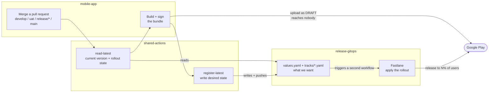

The last two arrows — `values.yaml + tracks/*.yaml` → **Fastlane** → **Google Play** — are a **second, separate workflow**. It runs in `release-gitops`, not in the repo you merged into, and it never appears as a check on your pull request. Merging your PR is what gets the build made and handed over; the Slack message a few minutes later is what tells you Play has actually been updated.

### Where results are announced

Each track reports to its own Slack channel, so you only see traffic for the thing you merged:

| Track | Channel |
|---|---|
| `develop` | `#app-dev-builds` |
| `uat` | `#app-qa-builds` |
| `release/*` and `main` | `#app-prod-releases` |

---

## 4. Where each branch comes from

Before any of the procedures below, here is the whole branching model on one screen. If you remember one thing, remember the **Cut from** column — it's the step people miss.

| Branch | Cut from | Open a PR into | What that merge triggers |
|---|---|---|---|
| your feature branch | `develop` | `develop` | internal build |
| `bugfix/<issue>` | `uat` | that round's `hotfix/DDMMYY_N` | nothing — the hotfix branch is a staging area |
| `hotfix/DDMMYY_N` | `uat` | `uat` | closed-testing build |
| `release/DD-MM-YY` | `main` | — *(you open a PR **from `uat`** into it)* | open testing @ 100% + production @ 5% |
| `release/DD-MM-YY` | — | `main` | production @ 100%, nothing new is built |

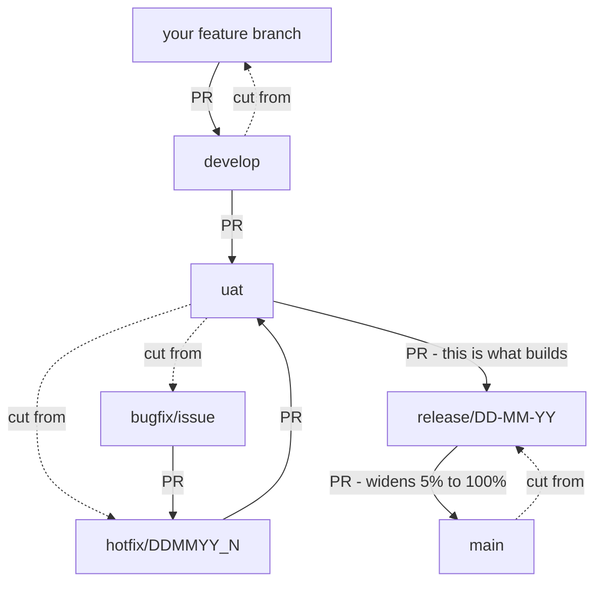

Solid arrows are pull requests. Dotted arrows show where a branch is **cut from** — creating a branch never builds anything on its own, so a dotted arrow is never a release.

Two things worth reading twice:

- **`release/DD-MM-YY` is cut from `main`, not from `uat`.** It starts at exactly what is live in production. The regression-tested changes arrive separately, through a PR from `uat`.
- **Cutting the release branch triggers nothing.** CD fires on a *merged pull request*, so the `uat` → `release/DD-MM-YY` merge is what produces the build.

---

## 5. What the pipeline checks

Two repositories, two sets of gates. Nothing merges past a red check, so it's worth knowing which applies to what you're doing.

### On your Android pull request

| Check | Runs on PRs into | Passes when |
|---|---|---|
| **Unit Test Gate** | `develop`, `uat`, `release/*` | The unit test suite passes. |
| **Android Production Sanity** | `develop`, `uat`, `release/*`, `main` | An automated review of your diff doesn't come back *Do Not Deploy*. A *Needs Fixes* verdict posts a change request on the PR instead of failing outright. |
| **Bet Enforcement Check** | `develop` only | The PR is linked to a tracked Bet via the **Development** section in the PR sidebar. |
| **PR Template Select** | any PR, on open | Not a gate — it fills in the right checklist for the branch you're targeting. |

Two gaps worth knowing: **Unit Test Gate doesn't run on PRs into `main`**, and **Bet Enforcement only runs on `develop`**. The Maestro end-to-end suite is manual — it never runs as a PR check.

### After you merge

CD takes over. One gate can stop it, and only on the release track:

> **`release/*` only** — if production is already mid-rollout (1–99%), the merge fails with
> `Production applied rollout is N%. Halt (0) or cd.main (100%) before the next release.`

Finish the in-flight rollout (merge to `main`) or stop it (set `0`), then merge again.

### On a rollout change in `release-gitops`

Editing a track file runs **CI - Main**, which validates:

- the file against its schema — `rollout` is an integer 0–100, all required fields present
- the **active-rollout guard** — you can't change `versionCode` or `versionName` on a track that is currently between 1% and 99%

### Rules applied at rollout time

These are enforced when the change reaches Play, **not** in CI — so a pull request that breaks one goes green and then fails after merging. Worth knowing before you edit:

- Raise the percentage, or set `0`. You cannot step **down** to a lower non-zero value — set `0` to stop instead.
- A release already at 100% is finished. It can't be reduced or halted.
- `internal-testing` accepts only `0` or `100`.
- A track's `versionCode` can't be ahead of `latest` — assign a build that has actually been uploaded.

---

## 6. Reading a rollout message

Every release — automatic or manual — announces itself in this format:

```
🚀 MobileApp — Production 4.2.0 (512)
• Status: Live at 6%
• Commit: a1b2c3d
• When: Sep 3, 2026 4:17 PM UTC
```

| Part | What it tells you |
|---|---|
| `MobileApp — Production` | The app, and which Play channel this message is about. |
| `4.2.0 (512)` | **The build.** The number in brackets is the `versionCode` — the value Play treats as the real identity. Trust it over the display string beside it. |
| `Status` | What the release is doing and how far it reaches, in one phrase. `Live at 6%` means a staged rollout currently serving 6% of users on that channel. |
| `Commit` | Short SHA of the merge commit that produced the build. Open it at `github.com/example-org/mobile-app/commit/a1b2c3d`. |
| `When` | Timestamp, in UTC. |

Read the **Status** line together with the version. A message where the version hasn't changed but the status has means the same build was widened or stopped — not that a new build shipped.

Each message is a single event, not a status board. A track that moved 5% → 20% → 50% produces three messages and the channel keeps all of them. For the *current* state, read [`applied.json`](https://github.com/example-org/release-gitops/blob/main/apps/mobile/applied.json) — that file is what the pipeline itself treats as truth.

---

## 7. Day-to-day testing — merge into `develop`

The fastest loop — your change is on a teammate's phone within minutes, with no Google review in the way.

**`develop` is a stable branch, not a scratch branch.** Everything on it is a candidate for the next release train. You merge here *after* you've proven your change works, not to find out whether it does.

### What gets tested here

`develop` is where a change is actually exercised before it goes anywhere near real users. Four kinds of checking happen on this build:

| | What it covers |
|---|---|
| **Feature testing** | Does the new thing work as specified? |
| **Bug testing** | Does the fix hold, and did it break anything nearby? |
| **Events testing** | Are analytics events firing, with the right names and payloads? |
| **Design QA** | Does it match the design — spacing, states, copy, edge cases on real screen sizes? |

That's why the tester list isn't just engineers. **Anyone at the company can be on it** — QA, product, design, data, or whoever needs to see the change on a real device. Play caps internal testing at **100 people**.

### Test it yourself first

`develop` is not where you discover whether your change works. That's settled before it gets there.

- **Test on a release build with R8 enabled**, not a debug build. R8 shrinks and obfuscates the code, and every build from here on uses it — so a release build behaves very close to production. Anything that only breaks under R8 (reflection, serialisation, a missing keep rule) will never show up on a debug build.
- **Test regressively**, not just the happy path of your own feature. Cover what your change touches and what sits next to it.
- **This applies to partial features too.** Something half-built behind a flag still has to be shown not to affect anything else.

Only once that's done does the change move to `develop`.

### Release Review

**Every change merging into `develop` needs Release Review approval.** Submit the form in `#release-review` and get the panel's sign-off before you merge.

What to prepare beforehand — peer reviews, the production sanity report, the release checklist — is covered in your organisation\'s release review process doc.

> [!WARNING]
> **This build always points at the develop backend, never production.** That's fixed in the build itself, not a setting you can toggle. So anything you see here — data, account state, payments, notifications — is develop data. Never treat behaviour on this build as evidence of what production does, and never use it to check a production incident.

### Before you merge

- [ ] You've tested it yourself on a **release build with R8**, including the areas around the change.
- [ ] **Release Review approved** — form submitted in `#release-review`, panel signed off.
- [ ] Your PR is reviewed and approved, as normal.
- [ ] You're merging into `develop`, not a `release/*` branch.
- [ ] Whoever needs to try it — QA, PM, design, data — is on the tester list. Internal builds reach nobody else.

### What happens

| You | The pipeline |
|---|---|
| Click **Merge**. Nothing else. | Computes a version like `4.2.1.develop.030926.a1b2c3d` — release train, track, date (IST), and the merge commit. |
| | Builds and signs the bundle. |
| | Uploads it to Play's internal channel as a draft. |
| | Sets internal testing to 100%. |
| | Posts to `#app-dev-builds`. |

### How to verify

| Check | Where |
|---|---|
| Timing | **15–20 minutes** from merge to the Slack message. Most of that is the build. |
| Build succeeded | Your merged PR's workflow goes green — the build was made and handed over. |
| Release landed | The message in `#app-dev-builds`, usually a few minutes later. |
| Reach | The tester list only — up to 100 people, from any team. No public user can reach this build. |
| Google review | None at this level. That's why it's fast. |

> [!TIP]
> Every merge to `develop` produces a new build and ships it. Five merges this morning means five builds, and testers will see repeated update prompts. That's the design working, not a fault.

---

## 8. Regression testing — merge into `uat`

The same code, built with production settings instead of developer ones, so QA tests something that behaves like the real thing.

### What gets tested here

`uat` is deliberately narrower than `develop`. The question here isn't "does the new thing work" — that was answered on `develop`. It's **"did we break anything that used to work."**

| | What it covers |
|---|---|
| **Regression testing** | A full pass over the release candidate before it goes to real users |
| **Hotfix regression** | The same pass scoped to an urgent fix and the areas it touches |

Feature, events, and design checks belong on `develop`. If something reaches `uat` without having been through that, it's arriving too late.

### Hotfixes

A hotfix branch carries fixes that must reach `uat` without going through `develop` — a bug already live in **production**, or one QA finds during a regression pass on the release candidate.

Every branch involved is cut from `uat`: each fix gets its own `bugfix/<issue>` branch, those merge into the round's `hotfix/DDMMYY_N` branch, and that one branch merges into `uat`. **`develop` is never patched** — it stays free for the next release train.

**Name the branch `hotfix/DDMMYY_N`** — the date, then the round number. The first round of fixes is `hotfix/030926_1`, a later round `hotfix/030926_2`, and so on.

#### When to open one

When a fix has to reach `uat` without passing through `develop`. That covers a bug already live in production, and a bug QA finds while regression-testing the release candidate — **both use this same path.** The name says "hotfix", but the test isn't urgency, it's whether the fix needs to skip `develop`.

#### How to open one

**Cut it from `uat`.** On GitHub: open the branch dropdown, type `hotfix/030926_1`, and pick **Create branch `hotfix/030926_1` from `uat`** — the "from" part of that button is what people miss, since the dropdown defaults to whichever branch you were viewing.

From a terminal, if you prefer:

```bash
git checkout uat && git pull && git checkout -b hotfix/030926_1
```

#### The shape of a round

| Step | What happens | Branch |
|---|---|---|
| **1** | Collect the full list of issues for the round — from production, or from a regression pass. | — |
| **2** | Cut the hotfix branch **from `uat`**. | `hotfix/030926_1` |
| **3** | Each fix gets its own branch, also **cut from `uat`**, and opens a PR **into the hotfix branch** — not into `uat`. | `bugfix/<issue>` → `hotfix/030926_1` |
| **4** | Once every fix is merged in, open one PR from the hotfix branch **into `uat`**. One merge, one build. | `hotfix/030926_1` → `uat` |
| **5** | QA re-tests. Anything still broken becomes the next round. | `hotfix/030926_2` |

**Why step 3 goes through the hotfix branch rather than straight into `uat`:** the hotfix branch is a **staging area**, nothing more. Merging into it builds nothing. Collecting the whole round there means `uat` receives *one* merge and produces *one* build, instead of one of each per fix.

Hotfix branches merge **directly into `uat`**. They don't route through `develop` first — a fix for a release candidate shouldn't drag in whatever else has landed on `develop` since it was cut.

> [!WARNING]
> **Cut the branch only once the round is complete**
>
> **Wait until every issue in the round has been identified before opening the hotfix branch.** Every merge into `uat` produces its own build, and every build then waits 2–12 hours on Google review.
>
> Merging fixes one at a time means QA spends the day chasing builds instead of testing, and it stops being obvious which build carries which fix. Batching the round into one merge gives QA a single build with a clear scope: *these are the fixes, re-test these areas.*

> [!NOTE]
> A fix living only on `uat` is missing from `develop`, so the next release train would ship without it. Get it back onto `develop` once the hotfix has gone out — after the fact, not by patching `develop` mid-cycle.

> [!CAUTION]
> **Build the night before**
>
> Closed testing goes through **Google review**, and that takes **2–12 hours** — it is not under our control and cannot be rushed. The Slack message arrives long before testers can actually install anything.
>
> **Merge to `uat` the evening before regression is due to start.** Merging on the morning of a regression cycle means waiting most of the day for the build to become installable.

### Before you merge

- [ ] The change has already been through `develop` and survived — or, for a hotfix, it's on a complete `hotfix/DDMMYY_N` branch.
- [ ] **It's the night before regression starts**, so Google review has time to clear.
- [ ] QA knows it's coming and knows what to test.
- [ ] Anything it depends on — a backend change, a feature flag, a config value — is already live in the environment QA will test against.
- [ ] You've told QA which version string to expect, so they can confirm they're on the right build.

### What happens

| You | The pipeline |
|---|---|
| Open a PR from `develop` into `uat`, get it approved, merge it. Share the version string once Slack announces it. | Computes a version like `4.2.1.uat.030926.a1b2c3d` — same shape as develop, with a `.uat.` label. |
| | Builds the production flavor, so behaviour matches what ships. |
| | Uploads it to Play's closed testing channel as a draft. |
| | Sets closed testing to 100%. |
| | Posts to `#app-qa-builds`. |

### How to verify

| Check | Where |
|---|---|
| Timing — build | **15–20 minutes** from merge to the Slack message. |
| Timing — installable | **A further 2–12 hours** while Google reviews the closed-testing release. The Slack message does *not* mean testers can install yet. |
| Version | Named in `#app-qa-builds`. |
| Delivery path | QA installs through the Play Store like any user — this exercises the real delivery path, not a sideloaded file. |
| Reach | The invited closed-testing list. Still no public users. |

If QA finds a bug during regression, **don't fix it on `develop`.** Fix it locally on a bugfix branch and send it through the hotfix path above — into that round's `hotfix/DDMMYY_N` branch, then into `uat`. `develop` stays free for the next release train.

---

## 9. Production release — merge into `release/*`, then `main`

Two merges, deliberately separated. The first reaches a small slice of real users; the second reaches everyone. The gap between them is where you watch for trouble.

> [!IMPORTANT]
> **Release branch naming**
>
> **Cut it from `main`**, and name it `release/DD-MM-YY` — the date you cut it. For example, `release/03-09-26`.
>
> Cutting from `main` means the branch starts at exactly what is live in production. The regression-tested changes arrive separately, in a PR from `uat`.
>
> The pipeline triggers on anything under `release/`, so a misnamed branch still builds. Sticking to the convention is what keeps the branch list readable and makes it obvious which release a branch belongs to.

### Before you merge to a release branch

- [ ] QA has signed off on the `uat` build — that's the branch the release PR comes from.
- [ ] You've cut `release/DD-MM-YY` **from `main`**, not from `uat` or `develop`.
- [ ] **No production rollout is currently in progress.** If one is, the merge is rejected — finish or stop it first.
- [ ] Backend changes this build depends on are already live in production.
- [ ] Someone is available to watch crash rates afterwards. A staged rollout nobody monitors is just a slow full release.

### Part one — merge into `release/*`

| You | The pipeline |
|---|---|
| **1.** Cut `release/DD-MM-YY` (e.g. `release/03-09-26`) **from `main`**. This on its own builds nothing. | Checks production isn't mid-rollout and stops with a clear error if it is. |
| **2.** Open a PR **from `uat`** into that release branch and merge it once approved. **This merge is what triggers the build.** | Bakes a clean version number — no date, no commit, just `4.3.0`. This is what users see. |
| **3.** Then **stop and watch** — crash rate, key funnels, support tickets — for at least a few hours, ideally a day. | Builds the release bundle and uploads it to open testing as a draft. |
| | Releases open testing fully, and opens production at **5%** using that same build. |

### Part two — merge into `main`

| You | The pipeline |
|---|---|
| Once the numbers look healthy, open a PR **from the `release/DD-MM-YY` branch** into `main` and merge it. | Moves production to **100%**. No new build — the same one, widened. |

### How to verify

| Check | Where |
|---|---|
| Timing — build | **15–20 minutes** from the `release/*` merge to the Slack message. |
| Timing — reaching users | **Hours more** while Google reviews the release. Don't promise a launch time to the hour. |
| Version and percentage | Named in `#app-prod-releases`. |
| The 5% gap | Deliberate. One user in twenty gets the new build; the other nineteen stay on the previous one, entirely unaffected. |
| Merging to `main` | Builds and uploads nothing — it only widens what's already there, so it takes a few minutes rather than 15–20. Any merged PR to `main` triggers it, including a docs change. |

---

## 10. Managing a live rollout

Opening production at 5% and completing it to 100% are automatic, driven by the two merges above. Everything in between — widening to 20%, or stopping early — is a change you make directly in [`release-gitops`](https://github.com/example-org/release-gitops).

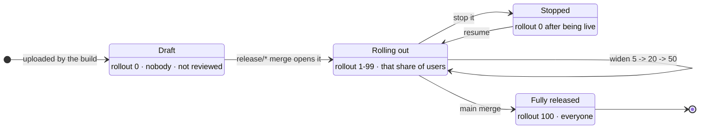

### The rules

- **Raise the number to widen, or set `0` to stop.** Those are the two moves.
- **You cannot step down to a lower non-zero value.** Going 20% → 5% is rejected; set `0` to stop instead.
- **A release at 100% is finished.** To change what users have, ship a new build.
- **`internal-testing` is `0` or `100` only** — Play doesn't support staged rollout on the internal channel.
- **Always change rollout here, never in the Play Console.** This repository is the source of truth; a change made directly in Play would be invisible to it.

### How to make the change

**1.** Open the track file in GitHub's editor:

[Edit `apps/mobile/tracks/production.yaml`](https://github.com/example-org/release-gitops/edit/main/apps/mobile/tracks/production.yaml)

**2.** Change only the `rollout:` line. Leave everything else exactly as it is.

**3.** Scroll to **Commit changes**, choose **Create a new branch for this commit and start a pull request**, and click **Propose changes**.

**4.** GitHub opens a new pull request, pre-filled with the repository's checklist. Work through it, get a review, and merge.

Merging is what calls Play. Watch `#app-prod-releases` for the result.

Swap `production` for `internal-testing`, `closed-testing`, or `open-testing` in that URL to adjust another channel — though the three testing channels are held at 100% by the pipeline, so you'd rarely need to.

---

## 11. Troubleshooting

Most of these aren't your change. Learn to tell them apart before you start reading code.

### `Production applied rollout is 20%. Halt (0) or cd.main (100%) before the next release.`

Working as designed — a previous release is still partway through reaching users, and the system won't stack a second one on top.

**Do:** find out who owns the in-progress release. Either complete it (merge to `main`) or stop it (set `0`, see [section 9](#10-managing-a-live-rollout)). Then merge yours again.

### `Version code NNN has already been used`

All tracks count up from one shared version number. Two merges on *different* branches finishing at the same moment can both claim it. Two merges into the same branch are queued and safe.

**Do:** re-run the failed workflow. It re-reads the version number and takes the next one.

### The push to `release-gitops` failed

Same cause — two pipelines wrote at once and one lost the race.

**Do:** re-run the failed workflow.

### The workflow failed and you can't find a Slack message

There is almost always one. Track-level failures post to that track's own channel, exactly like successes do. Failures earlier than that — dependency install, or writing the record back — post to `#app-prod-releases` instead.

**Do:** check the track's channel first, then `#app-prod-releases`. Both messages link the workflow run, and the reason is in that log.

### Nothing happened after merging

**Do:** confirm you merged into a branch with a pipeline attached — `develop`, `uat`, a `release/*` branch, or `main`. Anything else is a no-op by design. Also confirm the PR was genuinely *merged*, not just closed.

### The build itself failed

This one probably *is* your change — a compile error, a failing test, a dependency problem.

**Do:** read the workflow log like any other build failure. You don't need Android knowledge to read a stack trace.

---

## 12. Glossary

| Term | Meaning |
|---|---|
| **AAB / bundle** | The packaged app that gets uploaded. Google turns it into per-device downloads. |
| **versionCode** | An integer — the real identity of a build. Always increases, never reused. |
| **versionName** | The display string like `4.3.0`. What users see; nothing depends on it. |
| **Track / channel** | An audience on the Play Store. The same app can run a different version on each at the same time. |
| **internal / alpha / beta / production** | Google's names for internal, closed, open, and production. You'll see them in logs and Slack. |
| **Draft** | Uploaded to Google, released to nobody, not submitted for review. Every build starts here. |
| **Staged rollout** | Releasing to a percentage of users so problems hit a slice rather than everyone. |
| **Flavor** | Which app you're building — `develop` and `production` differ in app ID and which backend they talk to. This is the real difference between tracks. |
| **Build type** | How it's compiled. Both `analytics` and `Release` are optimised and release-signed; `analytics` adds a network inspector for debugging. |
| **Signing** | Stamping the build so Google knows it's genuinely ours. Fully automated — you never touch a key. |
| **Fastlane** | The tool the build servers use to talk to Google Play. You won't interact with it directly. |
